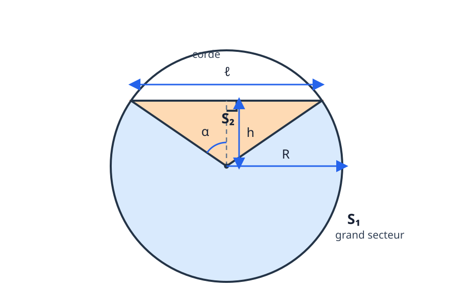

# Aire d’un segment circulaire et formule de l’angle double

  
<strong>Domaines :</strong> mathématiques, géométrie plane, trigonométrie

  
<strong>Synonymes :</strong> aire d’un segment de cercle, grand segment circulaire, aire sous une corde

  
<strong>Mots-clés :</strong> cercle, corde, secteur circulaire, triangle isocèle, sinus d’un angle double

Une corde de longueur $\ell$ coupe un disque de rayon $R$. Elle est située à
une hauteur $h$ au-dessus du centre et ses extrémités définissent un demi-angle
$\alpha$ avec la verticale.

La région située sous la corde se décompose en deux parties :

$$
S=S_1+S_2,
$$

où $S_1$ est le grand secteur circulaire et $S_2$ le triangle isocèle compris
entre la corde et le centre.

## Aire du grand secteur

Le grand secteur correspond à l’angle

$$
2\pi-2\alpha=2(\pi-\alpha).
$$

En coordonnées polaires, son aire vaut

$$
S_1
=\int_0^{2(\pi-\alpha)}
\int_0^R r\,\mathrm dr\,\mathrm d\theta.
$$

On calcule d’abord l’intégrale radiale :

$$
\int_0^R r\,\mathrm dr
=\left[\frac{r^2}{2}\right]_0^R
=\frac{R^2}{2}.
$$

Ainsi,

$$
\begin{aligned}
S_1
&=2(\pi-\alpha)\frac{R^2}{2}\\
&=\boxed{(\pi-\alpha)R^2}.
\end{aligned}
$$

## Longueur de la corde

La demi-corde, le rayon et la hauteur forment un triangle rectangle. Par
définition du sinus,

$$
\frac{\ell/2}{R}=\sin\alpha.
$$

On en déduit successivement

$$
\begin{aligned}
\frac{\ell}{2}
&=R\sin\alpha,\\
\ell
&=\boxed{2R\sin\alpha}.
\end{aligned}
$$

## Hauteur de la corde

Dans le même triangle rectangle,

$$
\frac{h}{R}=\cos\alpha.
$$

Par conséquent,

$$
\boxed{h=R\cos\alpha}.
$$

Pour la configuration dessinée, la corde se trouve au-dessus du centre et
$0\leq\alpha\leq\pi/2$. Les notes indiquent plus largement
$\alpha\in[0,\pi]$ ; au-delà de $\pi/2$, $h$ doit alors être compris comme une
distance orientée.

## Aire du triangle et angle double

Le triangle isocèle peut être partagé en deux triangles rectangles de base
$\ell/2$ et de hauteur $h$. Son aire est donc

$$
\begin{aligned}
S_2
&=2\times\frac{(\ell/2)h}{2}\\
&=\frac{\ell h}{2}.
\end{aligned}
$$

En remplaçant $\ell$ et $h$ par leurs expressions trigonométriques,

$$
\begin{aligned}
S_2
&=\frac{(2R\sin\alpha)(R\cos\alpha)}{2}\\
&=R^2\sin\alpha\cos\alpha.
\end{aligned}
$$

L’identité

$$
\sin(2\alpha)=2\sin\alpha\cos\alpha
$$

donne alors

$$
\boxed{
S_2=\frac{R^2}{2}\sin(2\alpha)
}.
$$

## Aire du segment circulaire

En réunissant les deux parties,

$$
\begin{aligned}
S
&=S_1+S_2\\
&=(\pi-\alpha)R^2
+\frac{R^2}{2}\sin(2\alpha).
\end{aligned}
$$

Ainsi,

$$
\boxed{
S=R^2\left(
\pi-\alpha+\frac12\sin(2\alpha)
\right)
}.
$$

L’angle $\alpha$ doit être exprimé en radians.

## Vérifications géométriques

- Si $\alpha=0$, la corde se réduit au point supérieur du cercle et
  $S=\pi R^2$ : toute l’aire du disque est sous la corde.
- Si $\alpha=\pi/2$, la corde est un diamètre et
  $S=\pi R^2/2$ : on obtient un demi-disque.
- Le terme $\sin(2\alpha)$ apparaît parce que l’aire du triangle contient le
  produit $\sin\alpha\cos\alpha$.

Cette décomposition relie donc directement la géométrie de la corde à la
formule trigonométrique de l’angle double.

## Notion liée

La construction utilise uniquement le rayon, la corde et les triangles
associés au cercle. Voir aussi la fiche
[Cercle passant par trois points](../cercle-par-trois-points/index.md).

