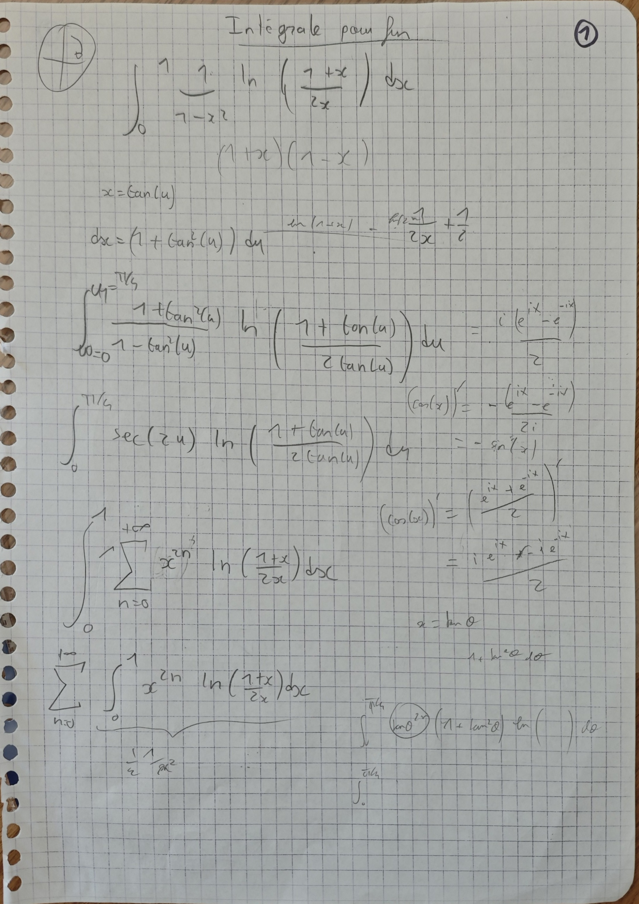
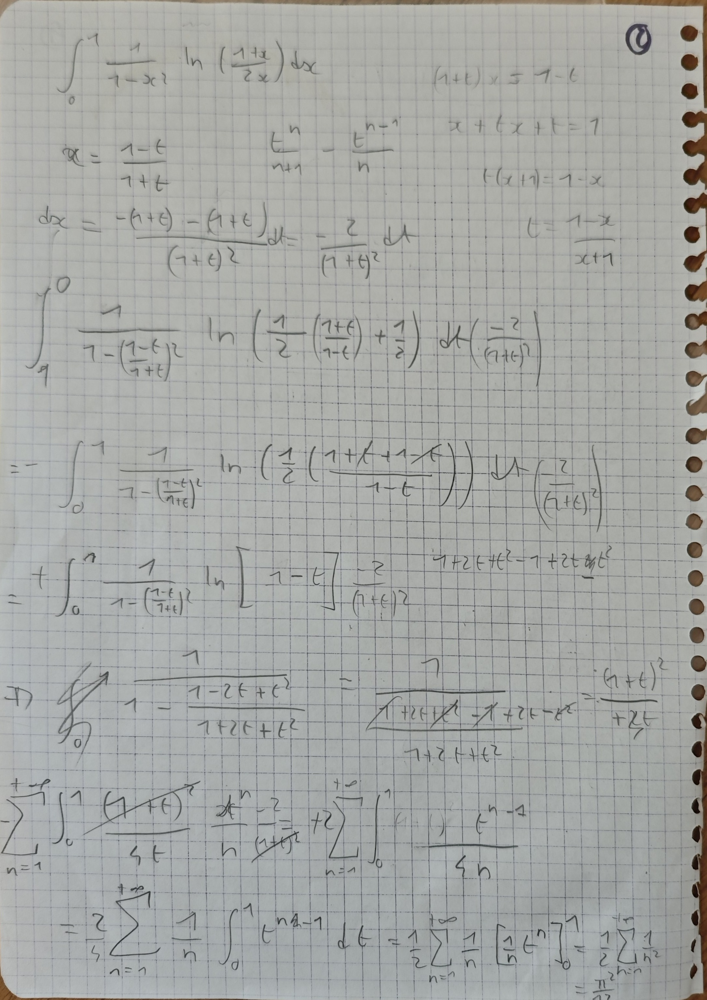

# Intégrale n° 1 — Du logarithme à la série de Bâle

  
<strong>Domaines :</strong> mathématiques, analyse, calcul intégral

  
<strong>Synonymes :</strong> intégrale logarithmique, représentation intégrale de ζ(2), intégrale liée à la série de Bâle

  
<strong>Mots-clés :</strong> logarithme, changement de variable homographique, série géométrique, série de Bâle, fonction zêta

L’intégrale étudiée est

$$
I=\int_0^1
\frac{1}{1-x^2}
\ln\!\left(\frac{1+x}{2x}\right)
\,\mathrm dx.
$$

Le changement de variable

$$
x=\frac{1-t}{1+t}
$$

transforme simultanément le facteur rationnel et le logarithme. L’intégrale
se ramène alors à une représentation de la série de Bâle, ce qui donne

$$
\boxed{I=\frac{\pi^2}{12}}.
$$

## Convergence aux bornes

Lorsque $x\to0^+$,

$$
\ln\!\left(\frac{1+x}{2x}\right)
\sim -\ln(2x),
$$

et cette singularité logarithmique est intégrable.

Lorsque $x\to1^-$, le numérateur logarithmique et le facteur $1-x^2$
s’annulent ensemble. Plus précisément,

$$
\ln\!\left(\frac{1+x}{2x}\right)
\sim \frac{1-x}{2}
$$

et

$$
1-x^2=(1-x)(1+x)\sim2(1-x).
$$

Ainsi,

$$
\frac{1}{1-x^2}
\ln\!\left(\frac{1+x}{2x}\right)
\longrightarrow\frac14.
$$

L’intégrale impropre est donc convergente aux deux extrémités.

## Changement de variable homographique

On pose

$$
x=\frac{1-t}{1+t}.
$$

La relation inverse se retrouve étape par étape :

$$
\begin{aligned}
(1+t)x&=1-t,\\
x+tx&=1-t,\\
t(x+1)&=1-x,\\
t&=\frac{1-x}{1+x}.
\end{aligned}
$$

Les bornes deviennent

$$
x=0\Longrightarrow t=1,
\qquad
x=1\Longrightarrow t=0.
$$

La différentielle vaut

$$
\begin{aligned}
\mathrm dx
&=\frac{-(1+t)-(1-t)}{(1+t)^2}\,\mathrm dt\\
&=-\frac{2}{(1+t)^2}\,\mathrm dt.
\end{aligned}
$$

## Transformation du logarithme

En remplaçant $x$ dans son argument,

$$
\begin{aligned}
\frac{1+x}{2x}
&=\frac{1+\dfrac{1-t}{1+t}}
{2\dfrac{1-t}{1+t}}\\
&=\frac{\dfrac{1+t+1-t}{1+t}}
{\dfrac{2(1-t)}{1+t}}\\
&=\frac{\dfrac{2}{1+t}}
{\dfrac{2(1-t)}{1+t}}\\
&=\frac{1}{1-t}.
\end{aligned}
$$

Par conséquent,

$$
\ln\!\left(\frac{1+x}{2x}\right)
=\ln\!\left(\frac{1}{1-t}\right)
=-\ln(1-t).
$$

## Transformation du facteur rationnel

On calcule séparément le dénominateur :

$$
\begin{aligned}
1-x^2
&=1-\left(\frac{1-t}{1+t}\right)^2\\
&=\frac{(1+t)^2-(1-t)^2}{(1+t)^2}\\
&=\frac{1+2t+t^2-(1-2t+t^2)}{(1+t)^2}\\
&=\frac{4t}{(1+t)^2}.
\end{aligned}
$$

Ainsi,

$$
\frac{1}{1-x^2}=\frac{(1+t)^2}{4t}.
$$

## Réduction à la série de Bâle

On rassemble maintenant toutes les transformations :

$$
\begin{aligned}
I
&=\int_1^0
\frac{(1+t)^2}{4t}
\ln\!\left(\frac{1}{1-t}\right)
\left(-\frac{2}{(1+t)^2}\right)
\,\mathrm dt\\
&=\int_1^0
-\frac{1}{2t}
\ln\!\left(\frac{1}{1-t}\right)
\,\mathrm dt\\
&=\frac12\int_0^1
\frac{1}{t}
\ln\!\left(\frac{1}{1-t}\right)
\,\mathrm dt\\
&=-\frac12\int_0^1
\frac{\ln(1-t)}{t}
\,\mathrm dt.
\end{aligned}
$$

Pour $0\leq t<1$, le développement logarithmique donne

$$
-\ln(1-t)=\sum_{n=1}^{+\infty}\frac{t^n}{n}.
$$

On obtient donc

$$
\begin{aligned}
I
&=\frac12\int_0^1
\frac1t
\sum_{n=1}^{+\infty}\frac{t^n}{n}
\,\mathrm dt\\
&=\frac12
\sum_{n=1}^{+\infty}\frac1n
\int_0^1 t^{n-1}\,\mathrm dt\\
&=\frac12
\sum_{n=1}^{+\infty}\frac1n
\left[\frac{t^n}{n}\right]_0^1\\
&=\frac12
\sum_{n=1}^{+\infty}\frac1{n^2}.
\end{aligned}
$$

En utilisant la somme de la série de Bâle,

$$
\sum_{n=1}^{+\infty}\frac1{n^2}=\frac{\pi^2}{6},
$$

on conclut :

$$
\boxed{
I=\frac12\cdot\frac{\pi^2}{6}
=\frac{\pi^2}{12}
}.
$$

## Pistes explorées dans le brouillon

Les notes montrent deux premières pistes qui n’ont pas été menées jusqu’au
résultat. Elles permettent de comprendre pourquoi le changement de variable
homographique a finalement été retenu.

### Substitution trigonométrique

Une première tentative consiste à poser

$$
x=\tan u,
\qquad
\mathrm dx=(1+\tan^2u)\,\mathrm du.
$$

Comme $x$ varie de $0$ à $1$, $u$ varie de $0$ à $\pi/4$. L’intégrale devient

$$
I=\int_0^{\pi/4}
\frac{1+\tan^2u}{1-\tan^2u}
\ln\!\left(\frac{1+\tan u}{2\tan u}\right)
\,\mathrm du.
$$

Cette écriture ne simplifie pas directement le logarithme ni le quotient
rationnel ; le brouillon abandonne donc cette voie.

### Développement géométrique direct

Une autre piste part de

$$
\frac{1}{1-x^2}
=\sum_{n=0}^{+\infty}x^{2n},
\qquad 0\leq x<1.
$$

Elle conduit formellement à

$$
\begin{aligned}
I
&=\int_0^1
\left(\sum_{n=0}^{+\infty}x^{2n}\right)
\ln\!\left(\frac{1+x}{2x}\right)
\,\mathrm dx\\
&=\sum_{n=0}^{+\infty}
\int_0^1
x^{2n}
\ln\!\left(\frac{1+x}{2x}\right)
\,\mathrm dx.
\end{aligned}
$$

Le brouillon pressent à cet endroit l’apparition d’une somme en $1/n^2$,
mais ne calcule pas explicitement l’intégrale générale. La substitution
$x=(1-t)/(1+t)$ fournit cette série beaucoup plus directement.

## Pages manuscrites

Les deux pages originales sont conservées avec l’entrée correspondante du
carnet.

## Idée à retenir

Le choix du changement de variable est guidé par la structure de l’intégrande.
La transformation

$$
x=\frac{1-t}{1+t}
$$

convertit à la fois

$$
\frac{1+x}{2x}
\quad\text{en}\quad
\frac1{1-t}
$$

et

$$
\frac{\mathrm dx}{1-x^2}
\quad\text{en}\quad
-\frac{\mathrm dt}{2t}.
$$

Le logarithme produit alors la série $\sum t^n/n$, tandis que le facteur
$1/t$ abaisse les puissances d’un degré. Après intégration, un second facteur
$1/n$ apparaît : c’est précisément le mécanisme qui fait émerger
$\sum 1/n^2$.
