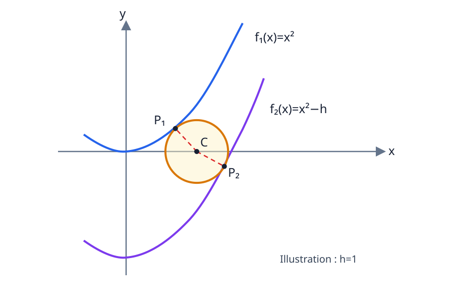

# Cercle tangent à deux paraboles verticalement décalées

  
<strong>Domaines :</strong> mathématiques, géométrie analytique, algèbre

  
<strong>Synonymes :</strong> cercle inscrit entre deux paraboles, cercle bitangent à deux paraboles, tangence parabole-cercle

  
<strong>Mots-clés :</strong> parabole, cercle tangent, normale, équation cubique, méthode de Cardano, résolution numérique

On considère les deux paraboles

$$
\begin{cases}
f_1(x)=x^2,\\
f_2(x)=x^2-h,
\end{cases}
\qquad h>0.
$$

Le problème consiste à déterminer un cercle tangent aux deux courbes et dont
le centre $C=(x_c,0)$ appartient à l’axe horizontal.

On note

$$
P_1=(x_1,x_1^2)
$$

le point de contact avec $f_1$, et

$$
P_2=(x_2,x_2^2-h)
$$

le point de contact avec $f_2$.

## Principe géométrique

Au point de tangence entre un cercle et une courbe régulière, le rayon est
perpendiculaire à la tangente. Le centre du cercle recherché doit donc se
trouver simultanément :

- sur la normale à $f_1$ en $P_1$ ;
- sur la normale à $f_2$ en $P_2$ ;
- sur l’axe $y=0$.

La concurrence des normales fournit une première condition. L’égalité des
distances $CP_1$ et $CP_2$ fournit ensuite la condition de rayon.

## Tangentes et normales

Les deux paraboles ont la même dérivée :

$$
f_1'(x)=f_2'(x)=2x.
$$

### Au point $P_1$

La tangente à $f_1$ en $x_1$ est

$$
t_1(x)=2x_1(x-x_1)+x_1^2.
$$

La pente de la normale vaut $-1/(2x_1)$. Son équation est donc

$$
p_1(x)
=-\frac{x-x_1}{2x_1}+x_1^2.
$$

Le centre est l’intersection de cette normale avec $y=0$. On impose

$$
p_1(x_c)=0,
$$

d’où

$$
\begin{aligned}
-\frac{x_c-x_1}{2x_1}+x_1^2
&=0,\\
-(x_c-x_1)+2x_1^3
&=0,\\
x_c
&=\boxed{2x_1^3+x_1}.
\end{aligned}
$$

### Au point $P_2$

La tangente à $f_2$ en $x_2$ est

$$
t_2(x)=2x_2(x-x_2)+x_2^2-h.
$$

La normale correspondante est

$$
p_2(x)
=-\frac{x-x_2}{2x_2}+x_2^2-h.
$$

La condition $p_2(x_c)=0$ donne

$$
\begin{aligned}
-\frac{x_c-x_2}{2x_2}+x_2^2-h
&=0,\\
-(x_c-x_2)+2x_2(x_2^2-h)
&=0,\\
x_c
&=\boxed{2x_2^3+x_2-2hx_2}.
\end{aligned}
$$

## Condition de concurrence des normales

Les deux expressions de $x_c$ doivent coïncider :

$$
\boxed{
2x_1^3+x_1
=2x_2^3+x_2-2hx_2
}.
$$

Si $x_1$ est considéré comme connu, cette relation devient une équation
cubique en $x_2$ :

$$
x_2^3
+\frac{1-2h}{2}x_2
-\left(x_1^3+\frac{x_1}{2}\right)
=0.
$$

Elle possède la forme déprimée

$$
x_2^3+px_2+q=0,
$$

avec

$$
\boxed{
p=\frac{1-2h}{2},
\qquad
q=-\left(x_1^3+\frac{x_1}{2}\right)
}.
$$

## Résolution de la cubique par Cardano

Les notes développent la méthode de Viète–Cardano. On pose

$$
x_2=u+v.
$$

Alors

$$
\begin{aligned}
0
&=(u+v)^3+p(u+v)+q\\
&=u^3+v^3+(3uv+p)(u+v)+q.
\end{aligned}
$$

On choisit $u$ et $v$ de manière que

$$
3uv+p=0,
$$

soit

$$
uv=-\frac p3.
$$

Il reste alors

$$
u^3+v^3=-q.
$$

En posant

$$
U=u^3,
\qquad
V=v^3,
$$

on obtient

$$
U+V=-q
$$

et

$$
UV=(uv)^3=-\frac{p^3}{27}.
$$

Les nombres $U$ et $V$ sont donc les racines de

$$
z^2+qz-\frac{p^3}{27}=0.
$$

Ainsi,

$$
U,V
=-\frac q2
\pm
\sqrt{\frac{q^2}{4}+\frac{p^3}{27}}.
$$

En introduisant

$$
\Delta_C
=\frac{q^2}{4}+\frac{p^3}{27},
$$

une racine réelle, lorsque $\Delta_C\geq0$, s’écrit

$$
\boxed{
x_2
=\sqrt[3]{-\frac q2+\sqrt{\Delta_C}}
+\sqrt[3]{-\frac q2-\sqrt{\Delta_C}}
}.
$$

La forme employée dans les notes utilise $v=-p/(3u)$ :

$$
x_2
=u-\frac{p}{3u},
\qquad
u=\sqrt[3]{
-\frac q2
\pm\frac12\sqrt{q^2+\frac{4p^3}{27}}
}.
$$

Lorsque $\Delta_C<0$, la cubique possède trois racines réelles. Il faut alors
les examiner toutes et conserver celles qui correspondent à la géométrie du
cercle.

## Calcul des deux rayons

La concurrence des normales ne suffit pas : le centre commun doit être à la
même distance des deux points de contact.

### Distance au premier point de contact

On a

$$
x_c-x_1=2x_1^3.
$$

Le premier rayon vaut donc

$$
\begin{aligned}
r_1
&=\sqrt{(x_c-x_1)^2+x_1^4}\\
&=\sqrt{(2x_1^3)^2+x_1^4}\\
&=\sqrt{4x_1^6+x_1^4}\\
&=\boxed{x_1^2\sqrt{4x_1^2+1}}.
\end{aligned}
$$

### Distance au second point de contact

De même,

$$
x_c-x_2=2x_2(x_2^2-h).
$$

Ainsi,

$$
\begin{aligned}
r_2
&=\sqrt{(x_c-x_2)^2+(x_2^2-h)^2}\\
&=\sqrt{[2x_2(x_2^2-h)]^2+(x_2^2-h)^2}\\
&=\sqrt{4x_2^2(x_2^2-h)^2+(x_2^2-h)^2}\\
&=\boxed{
|x_2^2-h|\sqrt{4x_2^2+1}
}.
\end{aligned}
$$

La valeur absolue rend explicite le fait qu’un rayon est positif. Dans la
configuration dessinée, $x_2^2<h$ et le second point se situe sous l’axe.

## Condition d’égalité des rayons

La condition $r_1=r_2$ peut être écrite sans racines en élevant au carré :

$$
\boxed{
x_1^4(4x_1^2+1)
=(x_2^2-h)^2(4x_2^2+1)
}.
$$

Le problème complet est donc le système

$$
\boxed{
\begin{cases}
2x_1^3+x_1
=2x_2^3+x_2-2hx_2,\\[2mm]
x_1^4(4x_1^2+1)
=(x_2^2-h)^2(4x_2^2+1).
\end{cases}
}
$$

Une fois $(x_1,x_2)$ déterminé,

$$
x_c=2x_1^3+x_1
$$

et

$$
r=x_1^2\sqrt{4x_1^2+1}.
$$

## Pourquoi la résolution reste numérique

La formule de Cardano exprime $x_2$ en fonction de $x_1$ et de $h$, mais elle
ne satisfait encore que la concurrence des normales. Il faut ensuite injecter
chaque branche admissible $x_2(x_1)$ dans l’égalité des rayons :

$$
F(x_1)
=x_1^4(4x_1^2+1)
-[x_2(x_1)^2-h]^2[4x_2(x_1)^2+1]
=0.
$$

Cette dernière équation devient très lourde si l’on remplace explicitement
$x_2$ par les radicaux de Cardano. La conclusion des notes est donc naturelle :
on résout $F(x_1)=0$ numériquement, puis on reconstruit $x_2$, $x_c$ et $r$.

Pour la branche représentée sur le schéma, on recherche notamment

$$
0<x_1<x_c<x_2,
\qquad
x_2^2<h.
$$

La symétrie des deux paraboles par rapport à l’axe vertical produit également
la solution miroir $(-x_1,-x_2,-x_c)$.

## Illustration pour $h=1$

Une résolution numérique du système donne, pour la branche située à droite,

$$
\begin{aligned}
x_1&\simeq0{,}4653168,\\
x_2&\simeq0{,}9271495,\\
x_c&\simeq0{,}6668173,\\
r&\simeq0{,}2957757.
\end{aligned}
$$

Les deux points de contact sont approximativement

$$
P_1=(0{,}4653168,\ 0{,}2165197)
$$

et

$$
P_2=(0{,}9271495,\ -0{,}1403938).
$$

Ces valeurs sont celles utilisées pour donner au schéma une géométrie
cohérente ; la démonstration reste valable pour un décalage général $h>0$.

## Une simplification à ne pas effectuer

Une tentative de la cinquième page passe de

$$
x_1(2x_1^2+1)
=x_2(2x_2^2+1-2h)
$$

à une égalité entre les deux facteurs entre parenthèses. Ce passage supposerait
que l’on puisse supprimer $x_1$ et $x_2$ comme s’ils étaient égaux. Or les deux
abscisses de contact sont généralement différentes.

~~~{warning}
La relation $x_1^2=x_2^2-h$ obtenue par cette simplification ne découle pas de
la condition de concurrence. Elle ne doit donc pas être utilisée pour calculer
le cercle général.
~~~

## Notions liées

La construction repose sur la même idée fondamentale que le cercle
osculateur : le centre se situe sur une normale à la courbe. Voir
[Du cercle au carré : géométrie d’une squircle](../du-cercle-au-carre-geometrie-d-une-squircle/index.md)
pour un exemple où un cercle est déterminé par la courbure locale d’une seule
courbe.

