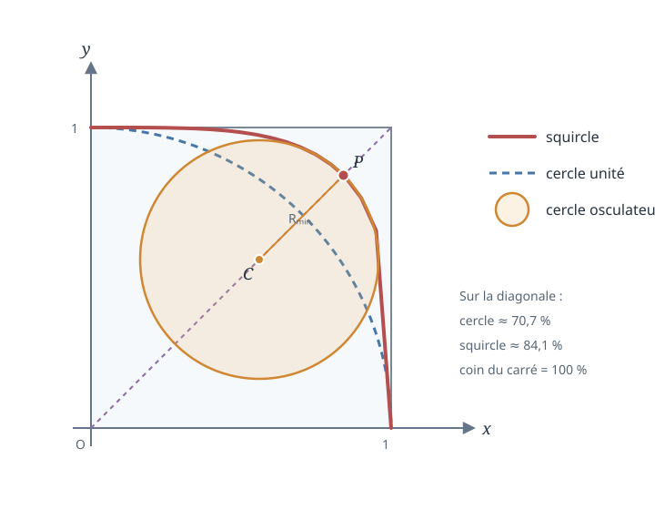

# Du cercle au carré : géométrie d'une squircle

  
<strong>Domaines :</strong> mathématiques, géométrie différentielle, courbes planes

  
<strong>Synonymes :</strong> squircle, superellipse d'exposant 4, cercle osculateur

  
<strong>Mots-clés :</strong> superellipse, courbure, rayon de courbure, diagonale, carré, cercle

## L'idée de l'exercice

L'exercice part d'une courbe très simple,

$$
x^4+y^4=1,
$$

et pose une question amusante : **où se situe cette forme entre le cercle et le carré ?**

Pour le voir, on la place dans le carré $[-1,1]^2$. Le cercle unité
$x^2+y^2=1$ et la squircle touchent tous les deux les axes aux points
$(\pm1,0)$ et $(0,\pm1)$, mais la squircle gonfle davantage vers les coins.

Les notes explorent cette idée de deux manières :

1. comparer la distance atteinte sur la diagonale par le cercle, la squircle et le carré ;
2. calculer, au point diagonal de la squircle, le cercle qui l'épouse le mieux localement : son **cercle osculateur**.

Le dessin original indiquait approximativement $70\,\%$, $84\,\%$ et
$100\,\%$. Ces nombres sont bien les proportions radiales, mesurées sur la
diagonale depuis l'origine jusqu'au coin du carré.

## 1. Pourquoi cette courbe ressemble-t-elle à un carré arrondi ?

La famille des superellipses

$$
|x|^n+|y|^n=1
$$

interpole visuellement entre plusieurs formes. Pour $n=2$, on obtient le
cercle unité. Quand $n$ augmente, la courbe se rapproche du bord du carré
$[-1,1]^2$. Le choix $n=4$ produit la squircle étudiée ici :

$$
x^4+y^4=1.
$$

Dans le premier quadrant, elle est le graphe

$$
y(x)=\left(1-x^4\right)^{1/4},
\qquad 0\leq x\leq1.
$$

## 2. Comparaison sur la diagonale

Considérons un rayon faisant un angle $\varphi$ avec l'axe horizontal :

$$
x=r\cos\varphi,
\qquad
y=r\sin\varphi.
$$

En remplaçant dans l'équation de la squircle,

$$
r^4\cos^4\varphi+r^4\sin^4\varphi=1,
$$

d'où

$$
r(\varphi)
=\frac{1}{\left(\cos^4\varphi+\sin^4\varphi\right)^{1/4}}.
$$

Sur la diagonale, $\varphi=\pi/4$, donc

$$
\cos\frac{\pi}{4}
=\sin\frac{\pi}{4}
=\frac{1}{\sqrt2}.
$$

La distance radiale de la squircle vaut alors

$$
\begin{aligned}
r_{\mathrm{squircle}}
&=\frac{1}{
\left(
2\left(\frac1{\sqrt2}\right)^4
\right)^{1/4}}\\
&=\frac1{(1/2)^{1/4}}\\
&=2^{1/4}.
\end{aligned}
$$

Le coin $(1,1)$ du carré est à la distance

$$
r_{\mathrm{carré}}=\sqrt{1^2+1^2}=\sqrt2.
$$

La squircle atteint donc la fraction

$$
\frac{r_{\mathrm{squircle}}}{r_{\mathrm{carré}}}
=\frac{2^{1/4}}{2^{1/2}}
=2^{-1/4}
\approx0{,}8409,
$$

soit environ $84{,}1\,\%$ du chemin vers le coin.

Pour le cercle unité, la distance radiale vaut simplement $1$, donc

$$
\frac{r_{\mathrm{cercle}}}{r_{\mathrm{carré}}}
=\frac1{\sqrt2}
\approx0{,}7071.
$$

On retrouve bien la lecture du croquis :

| Forme | Distance sur la diagonale | Fraction de la distance au coin |
|---|---:|---:|
| Cercle unité | $1$ | $70{,}7\,\%$ |
| Squircle $x^4+y^4=1$ | $2^{1/4}$ | $84{,}1\,\%$ |
| Carré | $\sqrt2$ | $100\,\%$ |

## 3. Le point diagonal de la squircle

Sur la diagonale, $x=y=s$. L'équation devient

$$
2s^4=1.
$$

Ainsi,

$$
s^4=\frac12,
\qquad
s=2^{-1/4}.
$$

Le point étudié dans les notes est donc

$$
P=\left(2^{-1/4},2^{-1/4}\right).
$$

Sa distance à l'origine est bien

$$
OP
=\sqrt{2\left(2^{-1/4}\right)^2}
=\sqrt{2^{1/2}}
=2^{1/4}.
$$

~~~{note}
Une hésitation visible dans les brouillons porte sur la coordonnée diagonale.
Il faut distinguer la distance radiale $OP=2^{1/4}$ de chacune des
coordonnées du point, qui vaut $2^{-1/4}$.
~~~

## 4. Dérivées de la squircle

Dans le premier quadrant,

$$
y=(1-x^4)^{1/4}.
$$

La dérivée première est

$$
\begin{aligned}
y'
&=\frac14(1-x^4)^{-3/4}(-4x^3)\\
&=-x^3(1-x^4)^{-3/4}.
\end{aligned}
$$

Pour la dérivée seconde, on applique la règle du produit :

$$
\begin{aligned}
y''
&=-3x^2(1-x^4)^{-3/4}\\
&\quad
-x^3\left[
-\frac34(1-x^4)^{-7/4}(-4x^3)
\right]\\
&=-3x^2(1-x^4)^{-3/4}
-3x^6(1-x^4)^{-7/4}.
\end{aligned}
$$

Au point diagonal, on a

$$
x=2^{-1/4},
\qquad
x^4=\frac12,
\qquad
1-x^4=\frac12.
$$

La pente devient

$$
\begin{aligned}
y'
&=-2^{-3/4}\left(\frac12\right)^{-3/4}\\
&=-1.
\end{aligned}
$$

La tangente a donc une pente $-1$, ce qui est cohérent avec la symétrie par
rapport à la diagonale.

Pour la dérivée seconde :

$$
\begin{aligned}
y''
&=-3\,2^{-1/2}\,2^{3/4}
-3\,2^{-3/2}\,2^{7/4}\\
&=-3\,2^{1/4}-3\,2^{1/4}\\
&=-6\,2^{1/4}.
\end{aligned}
$$

## 5. Courbure et rayon du cercle osculateur

Pour une courbe écrite sous la forme $y=f(x)$, la courbure vaut

$$
\kappa
=\frac{|y''|}{\left(1+(y')^2\right)^{3/2}}.
$$

Au point $P$ :

$$
\begin{aligned}
\kappa(P)
&=\frac{6\,2^{1/4}}{(1+1)^{3/2}}\\
&=\frac{6\,2^{1/4}}{2^{3/2}}\\
&=3\,2^{-1/4}.
\end{aligned}
$$

Le rayon de courbure, inverse de la courbure, est donc

$$
\boxed{
R_{\min}=\frac1{\kappa(P)}
=\frac{2^{1/4}}{3}
}.
$$

Il s'agit du plus petit rayon de courbure de cette squircle : la courbe est
le plus fortement courbée dans les quatre régions diagonales. Aux points
situés sur les axes, sa courbure tend au contraire vers zéro et le rayon de
courbure devient infini.

L'aire du cercle osculateur associé est

$$
\begin{aligned}
\mathcal A
&=\pi R_{\min}^2\\
&=\pi\left(\frac{2^{1/4}}{3}\right)^2\\
&=\boxed{\frac{\pi\sqrt2}{9}}.
\end{aligned}
$$

C'est la formule encadrée sur la première page des notes.

## 6. Où se trouve le centre du cercle osculateur ?

Au point diagonal, le vecteur normal dirigé vers l'intérieur est

$$
\mathbf{n}
=\frac1{\sqrt2}
\begin{pmatrix}
-1\\
-1
\end{pmatrix}.
$$

Le centre de courbure $C$ est obtenu en partant de $P$ et en avançant d'une
distance $R_{\min}$ le long de cette normale :

$$
C=P+R_{\min}\mathbf{n}.
$$

Chaque coordonnée vaut

$$
\begin{aligned}
C_x=C_y
&=2^{-1/4}-\frac{2^{1/4}}{3\sqrt2}\\
&=2^{-1/4}-\frac{2^{-1/4}}3\\
&=\frac23\,2^{-1/4}\\
&=\frac{2^{3/4}}3.
\end{aligned}
$$

Ainsi,

$$
\boxed{
C=\left(\frac{2^{3/4}}3,\frac{2^{3/4}}3\right)
}.
$$

La distance du centre de courbure à l'origine, également esquissée dans les
notes, est

$$
\begin{aligned}
OC
&=OP-R_{\min}\\
&=2^{1/4}-\frac{2^{1/4}}3\\
&=\frac23\,2^{1/4}.
\end{aligned}
$$

## Une vérification plus directe

Pour la courbe implicite

$$
F(x,y)=x^4+y^4-1=0,
$$

la formule de courbure implicite se simplifie en

$$
\kappa(x,y)
=\frac{3x^2y^2}{(x^6+y^6)^{3/2}}.
$$

Au point $x=y=2^{-1/4}$ :

$$
\begin{aligned}
\kappa
&=\frac{3(2^{-1/4})^4}
{\left(2(2^{-1/4})^6\right)^{3/2}}\\
&=3\,2^{-1/4},
\end{aligned}
$$

ce qui confirme le calcul précédent.

## Ce que l'exercice met en évidence

Ce jeu de calculs relie trois manières de regarder une même forme :

- **globalement**, la squircle occupe davantage les coins du carré que le cercle ;
- **radialement**, elle atteint $84{,}1\,\%$ de la diagonale du carré, contre
  $70{,}7\,\%$ pour le cercle ;
- **localement**, son arrondissement au point diagonal est décrit par un
  cercle osculateur de rayon $2^{1/4}/3$.

L'idée des notes était donc moins de « résoudre une équation » que de fabriquer
une mesure concrète du compromis entre cercle et carré : jusqu'où la forme
s'avance vers le coin, puis à quel point elle tourne lorsqu'elle y arrive.
