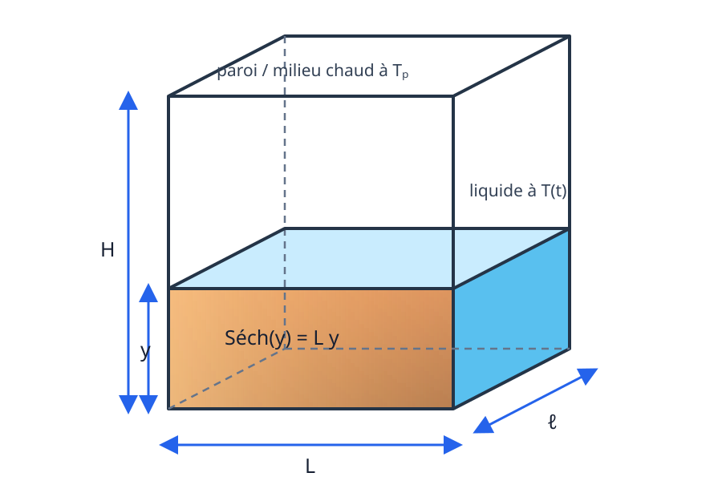

# Échauffement d’une cuve et rapport surface-volume

  
<strong>Domaines :</strong> thermique, transferts de chaleur, modélisation

  
<strong>Synonymes :</strong> chauffage d’une cuve, modèle thermique global, capacité thermique concentrée

  
<strong>Mots-clés :</strong> convection, surface d’échange, volume, hauteur de remplissage, constante de temps, bilan d’énergie

On étudie une cuve parallélépipédique de longueur $L$, de largeur $\ell$ et
de hauteur maximale $H$. Le liquide occupe une hauteur variable $y$, tandis
qu’une paroi verticale de surface $S_{\mathrm{éch}}(y)=Ly$ échange de la
chaleur avec un milieu maintenu à la température $T_p$.

L’idée centrale des notes est que la surface chauffée et le volume de liquide
sont tous deux proportionnels à $y$. Leur rapport ne dépend donc pas de la
hauteur de remplissage.

## Géométrie de la cuve

L’aire de la base est

$$
S_{\mathrm{base}}=L\ell.
$$

À la hauteur de remplissage $y$, le volume de liquide vaut

$$
\boxed{
V(y)=S_{\mathrm{base}}y=L\ell y
}.
$$

Les données inscrites dans les notes sont

$$
V_T=15\ \mathrm{m^3},
\qquad
S_{\mathrm{éch}}=16{,}8\ \mathrm{m^2},
\qquad
0<H\leq4{,}2\ \mathrm m.
$$

À remplissage maximal, $y=H$ et $V(H)=V_T$. Par conséquent,

$$
\begin{aligned}
V_T
&=S_{\mathrm{base}}H,\\
S_{\mathrm{base}}
&=\boxed{\frac{V_T}{H}}.
\end{aligned}
$$

La paroi d’échange a pour surface

$$
S_{\mathrm{éch}}(y)=Ly.
$$

À la hauteur maximale,

$$
\begin{aligned}
S_{\mathrm{éch}}
&=LH,\\
L
&=\boxed{\frac{S_{\mathrm{éch}}}{H}}.
\end{aligned}
$$

Enfin, puisque $S_{\mathrm{base}}=L\ell$,

$$
\begin{aligned}
\ell
&=\frac{S_{\mathrm{base}}}{L}\\
&=\frac{V_T/H}{S_{\mathrm{éch}}/H}\\
&=\boxed{\frac{V_T}{S_{\mathrm{éch}}}}.
\end{aligned}
$$

Numériquement,

$$
\ell
=\frac{15}{16{,}8}
\simeq0{,}893\ \mathrm m.
$$

La largeur $\ell$ est donc fixée par le volume total et la surface d’échange,
tandis que le choix de $H$ détermine $L=S_{\mathrm{éch}}/H$.

## Part de la surface totale parcourue par le flux

À remplissage maximal, on note

$$
S_{\ell}=\ell H
$$

l’aire de chacune des deux petites faces verticales. Pour une cuve fermée, la
surface totale est

$$
S_{\mathrm{tot}}
=2S_{\mathrm{éch}}+2S_{\ell}+2S_{\mathrm{base}}.
$$

La fraction de cette surface correspondant à une paroi d’échange est alors

$$
\alpha
=\frac{S_{\mathrm{éch}}}{S_{\mathrm{tot}}}.
$$

On développe l’expression étape par étape :

$$
\begin{aligned}
\alpha
&=\frac{S_{\mathrm{éch}}}
{2S_{\mathrm{éch}}+2S_{\ell}+2S_{\mathrm{base}}}\\
&=\frac{1/2}
{1+\dfrac{S_{\ell}}{S_{\mathrm{éch}}}
+\dfrac{S_{\mathrm{base}}}{S_{\mathrm{éch}}}}\\
&=\frac{1/2}
{1+\dfrac{\ell H}{S_{\mathrm{éch}}}
+\dfrac{\ell L}{S_{\mathrm{éch}}}}.
\end{aligned}
$$

Avec

$$
\ell=\frac{V_T}{S_{\mathrm{éch}}},
\qquad
L=\frac{S_{\mathrm{éch}}}{H},
$$

les deux rapports deviennent

$$
\frac{\ell H}{S_{\mathrm{éch}}}
=\frac{V_TH}{S_{\mathrm{éch}}^2}
$$

et

$$
\frac{\ell L}{S_{\mathrm{éch}}}
=\frac{V_T}{S_{\mathrm{éch}}H}.
$$

Ainsi,

$$
\begin{aligned}
\alpha
&=\frac{1/2}
{1+\dfrac{V_TH}{S_{\mathrm{éch}}^2}
+\dfrac{V_T}{S_{\mathrm{éch}}H}}\\
&=\boxed{
\frac{1/2}
{1+\dfrac{V_T}{S_{\mathrm{éch}}H}
\left(1+\dfrac{H^2}{S_{\mathrm{éch}}}\right)}
}.
\end{aligned}
$$

Chaque terme du dénominateur est bien sans dimension.

## Bilan thermique global

On suppose que :

- la température $T(t)$ est uniforme dans tout le liquide ;
- la température de la paroi ou du milieu chaud $T_p$ est constante ;
- la masse volumique $\rho$, la capacité thermique massique $c_p$ et le
  coefficient d’échange $h$ sont constants ;
- le flux thermique traverse uniquement la surface $S_{\mathrm{éch}}(y)$.

La masse de liquide à la hauteur $y$ vaut

$$
\begin{aligned}
m(y)
&=\rho V(y)\\
&=\rho S_{\mathrm{base}}y.
\end{aligned}
$$

Le bilan entre l’énergie stockée et la puissance thermique reçue est

$$
\boxed{
\rho V(y)c_p\frac{\mathrm dT}{\mathrm dt}
=hS_{\mathrm{éch}}(y)(T_p-T)
}.
$$

~~~{note}
La première écriture du brouillon omet le facteur $V$ devant $\rho c_p$. Le
contrôle des unités effectué sur la page suivante met ce problème en évidence :
$\rho c_p\,\mathrm dT/\mathrm dt$ est une puissance volumique, tandis que
$hS(T_p-T)$ est une puissance. La forme corrigée ci-dessus, reprise ensuite
dans les notes, est homogène.
~~~

## Pourquoi le niveau de liquide disparaît

Dans cette géométrie,

$$
S_{\mathrm{éch}}(y)=Ly
$$

et

$$
V(y)=L\ell y.
$$

Le rapport surface-volume vaut donc

$$
\begin{aligned}
\frac{S_{\mathrm{éch}}(y)}{V(y)}
&=\frac{Ly}{L\ell y}\\
&=\frac1\ell\\
&=\boxed{\frac{S_{\mathrm{éch}}}{V_T}}.
\end{aligned}
$$

Pour toute hauteur $y>0$, le facteur $y$ se simplifie. L’équation thermique
devient

$$
\frac{\mathrm dT}{\mathrm dt}
=\frac{hS_{\mathrm{éch}}}{\rho c_pV_T}(T_p-T).
$$

En posant

$$
\boxed{
k=\frac{hS_{\mathrm{éch}}}{\rho c_pV_T}
=\frac{h}{\rho c_p\ell}
},
$$

on obtient l’équation différentielle du premier ordre

$$
\frac{\mathrm dT}{\mathrm dt}=k(T_p-T).
$$

La constante $k$ s’exprime en $\mathrm{s^{-1}}$. La constante de temps
thermique associée est

$$
\boxed{
\tau=\frac1k
=\frac{\rho c_pV_T}{hS_{\mathrm{éch}}}
}.
$$

## Discrétisation temporelle explicite

Avec un pas de temps $\Delta t$, un schéma d’Euler explicite donne

$$
\begin{aligned}
T(t+\Delta t)
&=T(t)
+\frac{hS_{\mathrm{éch}}(y)}{\rho V(y)c_p}
[T_p-T(t)]\Delta t\\
&=T(t)
+\frac{hS_{\mathrm{éch}}}{\rho V_Tc_p}
[T_p-T(t)]\Delta t\\
&=\boxed{
T(t)+k[T_p-T(t)]\Delta t
}.
\end{aligned}
$$

En notation indicée,

$$
T^{n+1}
=T^n+\frac{\Delta t}{\tau}(T_p-T^n).
$$

Cette récurrence est exactement de la même forme que le schéma explicite de la
fiche [Discrétisation explicite et implicite d’un filtre du premier ordre](../filtre-premier-ordre-euler/index.md).

## Solution analytique

On part de

$$
\frac{\mathrm dT}{\mathrm dt}=k(T_p-T).
$$

Les notes introduisent l’écart à la température de la paroi. Pour ne pas le
confondre avec la hauteur de liquide $y$, on le note ici

$$
\theta=T_p-T.
$$

Alors

$$
\frac{\mathrm d\theta}{\mathrm dt}
=-\frac{\mathrm dT}{\mathrm dt},
$$

donc

$$
\frac{\mathrm d\theta}{\mathrm dt}=-k\theta.
$$

La solution générale est

$$
\theta(t)=Ae^{-kt}.
$$

Si $T(0)=T_0$, alors

$$
\begin{aligned}
\theta(0)
&=A\\
&=T_p-T_0.
\end{aligned}
$$

Par conséquent,

$$
\theta(t)=(T_p-T_0)e^{-kt}.
$$

En revenant à la température,

$$
T_p-T(t)=(T_p-T_0)e^{-kt},
$$

puis

$$
\boxed{
T(t)=T_p-(T_p-T_0)e^{-kt}
}.
$$

Lorsque $T_p>T_0$, la température du liquide tend exponentiellement vers
$T_p$. Dans le modèle retenu, la vitesse relative de cette évolution est
indépendante de la hauteur de remplissage, car le rapport
$S_{\mathrm{éch}}(y)/V(y)$ reste constant.

