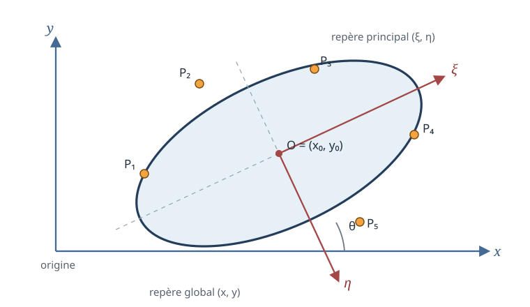

# Ellipse passant par cinq points

<div class="note-meta">
  <div><strong>Domaines :</strong> mathématiques, géométrie analytique, algèbre linéaire, calcul numérique</div>
  <div><strong>Synonymes :</strong> ellipse par cinq points, conique par cinq points, ajustement exact d'une ellipse, five-point conic</div>
  <div><strong>Mots-clés :</strong> conique, système homogène, déterminant, matrice quadratique, rotation, valeurs propres, centre, demi-axes</div>
</div>

## Idée générale

On cherche une courbe du second degré passant par cinq points donnés

$$
P_i=(x_i,y_i),\qquad i=1,\ldots,5.
$$

Le calcul se décompose naturellement en deux parties :

1. déterminer les six coefficients d'une conique, à un facteur multiplicatif près ;
2. vérifier que cette conique est bien une ellipse réelle, puis en extraire son centre, son orientation et ses demi-axes.

```{important}
Cinq points en position générique déterminent une **conique**, mais pas nécessairement une ellipse. La courbe obtenue peut aussi être une parabole, une hyperbole ou une conique dégénérée. La classification n'est donc pas une formalité : elle fait partie du problème.
```

La construction est l'analogue, au degré supérieur, du [cercle passant par trois points](../cercle-par-trois-points/index.md). Un cercle n'a besoin que de trois points parce que sa partie quadratique est déjà imposée : les coefficients de $x^2$ et de $y^2$ sont égaux et le terme $xy$ est absent.



Le schéma résume les deux repères utilisés ci-dessous. Le repère $(x,y)$ sert à écrire les coordonnées des cinq points. Après translation au centre $O=(x_0,y_0)$ et rotation d'un angle $\theta$, le repère principal $(\xi,\eta)$ fait disparaître le terme croisé.

## Convention de coefficients

On adopte partout l'équation

$$
Ax^2+Bxy+Cy^2+Dx+Ey+F=0.
$$

Les notes manuscrites alternent parfois les rôles de $B$ et $C$ en écrivant
$Ax^2+By^2+Cxy+\cdots=0$. Ce n'est qu'un changement de notation. La convention ci-dessus est conservée dans toute la fiche afin que les matrices, le discriminant et les formules d'angle restent cohérents.

## 1. Déterminer la conique passant par les cinq points

### Le système homogène

Chaque point $P_i$ fournit une équation linéaire dans les six coefficients :

$$
A x_i^2+B x_i y_i+C y_i^2+D x_i+E y_i+F=0.
$$

En posant

$$
\mathbf{c}=
\begin{pmatrix}
A\\B\\C\\D\\E\\F
\end{pmatrix},
$$

les cinq équations s'écrivent

$$
M\mathbf{c}=0,
$$

avec

$$
M=
\begin{pmatrix}
x_1^2 & x_1y_1 & y_1^2 & x_1 & y_1 & 1\\
x_2^2 & x_2y_2 & y_2^2 & x_2 & y_2 & 1\\
x_3^2 & x_3y_3 & y_3^2 & x_3 & y_3 & 1\\
x_4^2 & x_4y_4 & y_4^2 & x_4 & y_4 & 1\\
x_5^2 & x_5y_5 & y_5^2 & x_5 & y_5 & 1
\end{pmatrix}.
$$

Il y a cinq équations pour six inconnues, mais l'équation d'une conique ne change pas si tous ses coefficients sont multipliés par un même nombre non nul. Lorsque $\operatorname{rang}(M)=5$, le noyau de $M$ est donc de dimension $1$ : il donne une unique conique à un facteur près.

En calcul numérique, on récupère $\mathbf{c}$ comme vecteur singulier droit associé à la plus petite valeur singulière de $M$. Pour un calcul symbolique, on peut fixer une normalisation, par exemple $F=-1$, à condition que le coefficient choisi ne soit pas nul.

### La formule déterminantale des notes

La même conique peut être écrite sans choisir de normalisation. Un point variable $(x,y)$ appartient à la conique si les six lignes suivantes sont linéairement dépendantes :

$$
\det
\begin{pmatrix}
x^2 & xy & y^2 & x & y & 1\\
x_1^2 & x_1y_1 & y_1^2 & x_1 & y_1 & 1\\
x_2^2 & x_2y_2 & y_2^2 & x_2 & y_2 & 1\\
x_3^2 & x_3y_3 & y_3^2 & x_3 & y_3 & 1\\
x_4^2 & x_4y_4 & y_4^2 & x_4 & y_4 & 1\\
x_5^2 & x_5y_5 & y_5^2 & x_5 & y_5 & 1
\end{pmatrix}=0.
$$

En développant suivant la première ligne, on retrouve une expression de la forme

$$
Ax^2+Bxy+Cy^2+Dx+Ey+F=0,
$$

où chaque coefficient est, au signe près, un mineur d'ordre $5$. C'est exactement la construction esquissée sur la première série de pages.

## 2. Classifier la conique obtenue

La partie quadratique s'écrit

$$
Ax^2+Bxy+Cy^2
=
\begin{pmatrix}x&y\end{pmatrix}
Q
\begin{pmatrix}x\\y\end{pmatrix},
\qquad
Q=
\begin{pmatrix}
A & B/2\\
B/2 & C
\end{pmatrix}.
$$

Le discriminant quadratique vaut

$$
\delta=B^2-4AC.
$$

Pour une conique réelle non dégénérée :

- $\delta<0$ correspond au type elliptique ;
- $\delta=0$ correspond au type parabolique ;
- $\delta>0$ correspond au type hyperbolique.

Le test $\delta<0$ signifie que $Q$ est définie, à un signe global près. Il faut encore vérifier que l'ellipse est réelle et non dégénérée. La matrice homogène complète est

$$
H=
\begin{pmatrix}
A & B/2 & D/2\\
B/2 & C & E/2\\
D/2 & E/2 & F
\end{pmatrix}.
$$

La conique est dégénérée lorsque $\det H=0$. Le caractère réel sera vérifié après la translation, grâce au signe de la constante $K$.

## 3. Trouver le centre par translation

Le centre $O=(x_0,y_0)$ est le point où les termes linéaires disparaissent. Il vérifie

$$
\begin{cases}
2Ax_0+By_0+D=0,\\
Bx_0+2Cy_0+E=0.
\end{cases}
$$

Sous forme matricielle,

$$
\begin{pmatrix}
2A&B\\
B&2C
\end{pmatrix}
\begin{pmatrix}x_0\\y_0\end{pmatrix}
=-
\begin{pmatrix}D\\E\end{pmatrix}.
$$

Le déterminant de ce système vaut

$$
\Delta=4AC-B^2=-\delta.
$$

Lorsque $\Delta\neq0$, la règle de Cramer donne

$$
x_0
=\frac{(-D)(2C)-B(-E)}{\Delta}
=\frac{BE-2CD}{4AC-B^2},
$$

et

$$
y_0
=\frac{2A(-E)-(-D)B}{\Delta}
=\frac{BD-2AE}{4AC-B^2}.
$$

### Développement complet de la translation

On pose

$$
x=x_0+u,
\qquad
y=y_0+v.
$$

L'équation devient

$$
\begin{aligned}
0={}&A(u+x_0)^2+B(u+x_0)(v+y_0)+C(v+y_0)^2\\
&+D(u+x_0)+E(v+y_0)+F.
\end{aligned}
$$

Après développement et regroupement,

$$
\begin{aligned}
0={}&Au^2+Buv+Cv^2\\
&+(2Ax_0+By_0+D)u\\
&+(Bx_0+2Cy_0+E)v\\
&+K,
\end{aligned}
$$

où

$$
K=Ax_0^2+Bx_0y_0+Cy_0^2+Dx_0+Ey_0+F.
$$

Les deux coefficients linéaires sont nuls par définition du centre. Il reste donc

$$
Au^2+Buv+Cv^2+K=0.
$$

### Calcul explicite de la constante $K$

En notant $\mathbf{d}=(D,E)^\mathsf{T}$ et $\mathbf{h}=(x_0,y_0)^\mathsf{T}$, la condition du centre est

$$
2Q\mathbf{h}+\mathbf{d}=0.
$$

Elle implique

$$
\mathbf{h}^\mathsf{T}Q\mathbf{h}
=-\frac12\mathbf{d}^\mathsf{T}\mathbf{h}.
$$

Par conséquent,

$$
K
=F+\mathbf{d}^\mathsf{T}\mathbf{h}+\mathbf{h}^\mathsf{T}Q\mathbf{h}
=F+\frac12\mathbf{d}^\mathsf{T}\mathbf{h}.
$$

En remplaçant $x_0$ et $y_0$ :

$$
\begin{aligned}
K
&=F+\frac12(Dx_0+Ey_0)\\
&=F+\frac{D(BE-2CD)+E(BD-2AE)}{2\Delta}\\
&=F+\frac{2BDE-2CD^2-2AE^2}{2\Delta}\\
&=F+\frac{BDE-CD^2-AE^2}{\Delta}\\
&=\frac{F(4AC-B^2)+BDE-CD^2-AE^2}{4AC-B^2}.
\end{aligned}
$$

Sous la forme utilisant le dénominateur $B^2-4AC$, comme dans les brouillons :

$$
K=
\frac{AE^2+CD^2-BDE+(B^2-4AC)F}{B^2-4AC}.
$$

Les deux formules sont strictement équivalentes.

## 4. Faire disparaître le terme croisé par rotation

On introduit les coordonnées principales $(\xi,\eta)$ avec la convention

$$
\begin{pmatrix}u\\v\end{pmatrix}
=
\begin{pmatrix}
\cos\theta&-\sin\theta\\
\sin\theta&\cos\theta
\end{pmatrix}
\begin{pmatrix}\xi\\\eta\end{pmatrix}.
$$

Ainsi,

$$
u=\xi\cos\theta-\eta\sin\theta,
\qquad
v=\xi\sin\theta+\eta\cos\theta.
$$

Développons séparément les trois termes quadratiques :

$$
\begin{aligned}
Au^2
={}&A\xi^2\cos^2\theta
-2A\xi\eta\sin\theta\cos\theta
+A\eta^2\sin^2\theta,\\
Buv
={}&B\xi^2\sin\theta\cos\theta
+B\xi\eta(\cos^2\theta-\sin^2\theta)\\
&-B\eta^2\sin\theta\cos\theta,\\
Cv^2
={}&C\xi^2\sin^2\theta
+2C\xi\eta\sin\theta\cos\theta
+C\eta^2\cos^2\theta.
\end{aligned}
$$

Le coefficient de $\xi\eta$ est donc

$$
2(C-A)\sin\theta\cos\theta
+B(\cos^2\theta-\sin^2\theta).
$$

Avec les identités

$$
\sin(2\theta)=2\sin\theta\cos\theta,
\qquad
\cos(2\theta)=\cos^2\theta-\sin^2\theta,
$$

la condition d'annulation devient

$$
(C-A)\sin(2\theta)+B\cos(2\theta)=0.
$$

Donc

$$
\tan(2\theta)=\frac{B}{A-C}.
$$

Une écriture numériquement plus robuste, qui choisit aussi le bon quadrant, est

$$
\theta=\frac12\operatorname{atan2}(B,A-C),
$$

à un échange des deux axes près. Avec la convention de rotation inverse employée sur certaines pages manuscrites, l'angle prend le signe opposé ; la géométrie reste la même.

Si l'on veut retrouver la formule en $\tan\theta$, on utilise

$$
\tan(2\theta)=\frac{2\tan\theta}{1-\tan^2\theta}.
$$

En posant $t=\tan\theta$, on obtient

$$
B t^2+2(A-C)t-B=0,
$$

puis

$$
t
=\frac{-(A-C)\pm\sqrt{(A-C)^2+B^2}}{B}.
$$

Les deux racines correspondent aux deux directions principales, perpendiculaires l'une à l'autre.

## 5. Retrouver les axes par les valeurs propres

La rotation précédente n'est rien d'autre que la diagonalisation de la matrice symétrique $Q$. Ses valeurs propres satisfont

$$
\det(Q-\lambda I)=0.
$$

Ainsi,

$$
\begin{aligned}
0
&=\det
\begin{pmatrix}
A-\lambda&B/2\\
B/2&C-\lambda
\end{pmatrix}\\
&=(A-\lambda)(C-\lambda)-\frac{B^2}{4}\\
&=\lambda^2-(A+C)\lambda+AC-\frac{B^2}{4}.
\end{aligned}
$$

Le discriminant de cette équation est

$$
\begin{aligned}
\mathcal D
&=(A+C)^2-4\left(AC-\frac{B^2}{4}\right)\\
&=A^2+2AC+C^2-4AC+B^2\\
&=(A-C)^2+B^2.
\end{aligned}
$$

Les valeurs propres sont donc

$$
\lambda_{\pm}
=\frac{A+C\pm\sqrt{(A-C)^2+B^2}}{2}.
$$

Dans le repère principal, l'équation centrée devient

$$
\lambda_1\xi^2+\lambda_2\eta^2+K=0.
$$

Si $Q$ est définie positive, alors $\lambda_1,\lambda_2>0$. Une ellipse réelle exige alors $K<0$, et

$$
\frac{\xi^2}{-K/\lambda_1}
+\frac{\eta^2}{-K/\lambda_2}=1.
$$

Les carrés des deux demi-axes sont donc

$$
r_1^2=-\frac{K}{\lambda_1},
\qquad
r_2^2=-\frac{K}{\lambda_2}.
$$

En ordonnant $0<\lambda_{\min}\leq\lambda_{\max}$ :

$$
a=\sqrt{-\frac{K}{\lambda_{\min}}},
\qquad
b=\sqrt{-\frac{K}{\lambda_{\max}}},
\qquad a\geq b.
$$

Si $Q$ est définie négative, on peut multiplier toute l'équation par $-1$. Les quotients $-K/\lambda_i$, donc les demi-axes, ne changent pas.

## 6. Vérification par développement de l'équation canonique

Une ellipse de centre $(x_0,y_0)$, de demi-axes $a,b$ et tournée d'un angle $\theta$ peut s'écrire

$$
\frac{\bigl((x-x_0)\cos\theta+(y-y_0)\sin\theta\bigr)^2}{a^2}
+
\frac{\bigl(-(x-x_0)\sin\theta+(y-y_0)\cos\theta\bigr)^2}{b^2}
=1.
$$

En posant $X=x-x_0$ et $Y=y-y_0$, le premier carré vaut

$$
(X\cos\theta+Y\sin\theta)^2
=X^2\cos^2\theta
+2XY\sin\theta\cos\theta
+Y^2\sin^2\theta,
$$

et le second

$$
(-X\sin\theta+Y\cos\theta)^2
=X^2\sin^2\theta
-2XY\sin\theta\cos\theta
+Y^2\cos^2\theta.
$$

La partie quadratique développée possède donc les coefficients

$$
A=\frac{\cos^2\theta}{a^2}+\frac{\sin^2\theta}{b^2},
$$

$$
B=2\sin\theta\cos\theta
\left(\frac1{a^2}-\frac1{b^2}\right),
$$

$$
C=\frac{\sin^2\theta}{a^2}+\frac{\cos^2\theta}{b^2}.
$$

On vérifie alors directement que

$$
A-C
=\cos(2\theta)
\left(\frac1{a^2}-\frac1{b^2}\right),
$$

et

$$
B
=\sin(2\theta)
\left(\frac1{a^2}-\frac1{b^2}\right).
$$

D'où, lorsque $a\neq b$,

$$
\tan(2\theta)=\frac{B}{A-C},
$$

ce qui confirme la formule obtenue par annulation du terme croisé.

Lorsque $a=b$, l'ellipse est un cercle : $A=C$ et $B=0$. L'angle devient indéterminé parce que toutes les directions sont alors des axes principaux.

## 7. Paramétrisation finale

Une fois $(x_0,y_0)$, $a$, $b$ et $\theta$ connus, l'ellipse peut être parcourue avec $t\in[0,2\pi)$ :

$$
\begin{cases}
x(t)=x_0+a\cos t\cos\theta-b\sin t\sin\theta,\\
y(t)=y_0+a\cos t\sin\theta+b\sin t\cos\theta.
\end{cases}
$$

Cette forme est particulièrement utile pour tracer la courbe et vérifier numériquement que les cinq points initiaux satisfont bien l'équation implicite.

## Recette de calcul complète

À partir des cinq points $P_i$ :

1. construire la matrice $M$ et calculer un vecteur non nul de son noyau ;
2. lire les coefficients $(A,B,C,D,E,F)$ avec une convention fixée une fois pour toutes ;
3. vérifier que $\operatorname{rang}(M)=5$ ;
4. calculer $\delta=B^2-4AC$ et écarter le cas non elliptique si $\delta\geq0$ ;
5. calculer le centre $(x_0,y_0)$ ;
6. calculer $K$ après translation ;
7. diagonaliser $Q$ pour obtenir les directions principales et $\lambda_1,\lambda_2$ ;
8. vérifier que les quantités $-K/\lambda_i$ sont strictement positives ;
9. en déduire $a$, $b$ et l'angle $\theta$ ;
10. réinjecter les cinq points dans l'équation pour contrôler les résidus.

## Cas limites et précautions

### Points non génériques

Si $\operatorname{rang}(M)<5$, plusieurs coniques passent par les cinq points. Cela arrive notamment lorsque des points sont répétés ou lorsque la configuration impose une dégénérescence. Le déterminant à six lignes peut alors être identiquement nul.

### Ajustement exact ou ajustement bruité

La construction précédente est une interpolation exacte. Avec des mesures bruitées et plus de cinq points, on cherche plutôt le vecteur $\mathbf{c}$ minimisant $\lVert M\mathbf{c}\rVert$ sous une contrainte de normalisation. Une simple résolution aux moindres carrés ne garantit toutefois pas toujours une ellipse ; il faut conserver une contrainte elliptique ou classifier le résultat après coup.

### Signes et conventions de rotation

Deux sources fréquentes d'écarts apparents dans les formules sont :

- l'ordre choisi pour les coefficients $B$ et $C$ ;
- le choix entre une rotation des axes et une rotation de la courbe.

Ces choix peuvent changer le signe de $\theta$ ou écrire $\tan(2\theta)$ sous une forme opposée. Ils ne changent ni le centre, ni les valeurs propres, ni les longueurs des demi-axes.

## Résultat essentiel

La logique complète tient dans l'écriture matricielle

$$
\mathbf{z}^\mathsf{T}Q\mathbf{z}+\mathbf{d}^\mathsf{T}\mathbf{z}+F=0,
\qquad
\mathbf{z}=\begin{pmatrix}x\\y\end{pmatrix}.
$$

La translation

$$
\mathbf{z}=\mathbf{h}+\mathbf{u},
\qquad
\mathbf{h}=-\frac12Q^{-1}\mathbf{d},
$$

supprime les termes linéaires, puis une matrice orthogonale de vecteurs propres de $Q$ supprime le terme croisé. Toute la longue démonstration algébrique des pages manuscrites est la version développée de ces deux opérations : **translation au centre, puis rotation vers les axes propres**.
