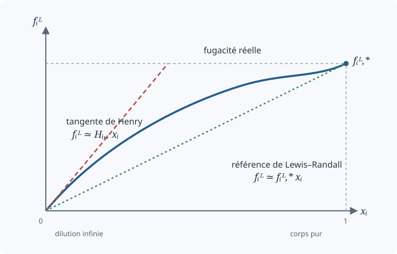

# Fugacité des solutions diluées et loi de Henry

  
<strong>Domaines :</strong> thermodynamique chimique, équilibres de phases, solutions

  
<strong>Synonymes :</strong> constante de Henry, état de référence de Henry, fugacité à dilution infinie

  
<strong>Mots-clés :</strong> fugacité, potentiel chimique, activité, coefficient d'activité, dilution infinie, loi de Raoult

## Idée générale

La loi de Henry décrit la dissolution d'une espèce volatile très diluée dans
un liquide. À température fixée, sa pression partielle dans la phase gazeuse
est proportionnelle à sa fraction molaire dans la phase liquide :

$$
\boxed{
p_i=H_{i,s}\,x_i
}.
$$

Ici :

- $i$ désigne le soluté ;
- $s$ désigne le solvant ;
- $x_i$ est la fraction molaire du soluté dans le liquide ;
- $p_i$ est sa pression partielle dans le gaz ;
- $H_{i,s}$ est la constante de Henry du soluté $i$ dans le solvant $s$.

Dans cette convention, $H_{i,s}$ possède l'unité d'une pression. Les notes la
notent parfois $R_{H,\sigma,s}$ ou $k_{H,\sigma,s}$ ; on adopte ici une seule
notation.

~~~{warning}
Il existe plusieurs conventions appelées « constante de Henry » : pression
sur fraction molaire, concentration sur pression, ou leurs inverses. Leurs
valeurs numériques et leurs unités ne sont pas interchangeables. Toute cette
fiche utilise exclusivement la forme $p_i=H_{i,s}x_i$.
~~~

## De la pression partielle à la fugacité

La pression partielle suffit pour un gaz idéal. Pour une phase réelle, on la
remplace par la fugacité $f_i$, grandeur ayant également l'unité d'une
pression.

À l'équilibre entre une phase liquide $L$ et une phase vapeur $V$, le potentiel
chimique de chaque espèce est identique dans les deux phases :

$$
\mu_i^L=\mu_i^V.
$$

Cette condition est équivalente à

$$
\boxed{
f_i^L=f_i^V
}.
$$

À faible pression, si la vapeur est assimilée à un mélange de gaz idéaux,

$$
f_i^V\simeq y_iP=p_i,
$$

où $y_i$ est la fraction molaire du composé dans la vapeur. La loi de Henry
peut donc s'écrire plus généralement, dans la limite diluée,

$$
\boxed{
f_i^L\simeq H_{i,s}x_i
}.
$$

## La constante de Henry comme pente à dilution infinie

Considérons la fugacité liquide $f_i^L$ à température et pression fixées.
Lorsque le soluté disparaît de la solution,

$$
\lim_{x_i\to0}f_i^L=0.
$$

La loi de Henry est le développement linéaire de $f_i^L$ au voisinage de
$x_i=0$ :

$$
f_i^L
=f_i^L(0)
+\left(
\frac{\partial f_i^L}{\partial x_i}
\right)_{T,P,x_i=0}x_i
+o(x_i).
$$

Puisque $f_i^L(0)=0$,

$$
f_i^L
\simeq
\left(
\frac{\partial f_i^L}{\partial x_i}
\right)_{T,P,x_i=0}x_i.
$$

On identifie alors

$$
\boxed{
H_{i,s}
=\lim_{x_i\to0}\frac{f_i^L}{x_i}
=\left(
\frac{\partial f_i^L}{\partial x_i}
\right)_{T,P,x_i=0}
}.
$$

La constante de Henry est donc la pente initiale de la courbe
$f_i^L(x_i)$.

## Écart à l'idéalité : coefficient d'activité de Henry

À concentration finie, la relation n'est généralement plus exactement
linéaire. On introduit un coefficient d'activité $\gamma_i^H$ :

$$
\boxed{
f_i^L=x_i\gamma_i^H H_{i,s}
}.
$$

L'état de référence est choisi de façon que

$$
\boxed{
\lim_{x_i\to0}\gamma_i^H=1
}.
$$

L'activité du soluté sur l'échelle de Henry vaut alors

$$
a_i^H=x_i\gamma_i^H,
$$

et

$$
f_i^L=a_i^H H_{i,s}.
$$

Le coefficient $\gamma_i^H$ mesure l'écart entre la fugacité réelle et la
droite de Henry extrapolée depuis la dilution infinie.

## Deux états de référence : Henry et Lewis–Randall

Les pages manuscrites comparent deux limites de composition.

### Limite du soluté infiniment dilué

Lorsque

$$
x_i\to0,
$$

la référence naturelle est celle de Henry :

$$
f_i^L\simeq x_iH_{i,s},
\qquad
\gamma_i^H\to1.
$$

### Limite du corps pur

Lorsque

$$
x_i\to1,
$$

la fugacité tend vers celle du corps pur liquide :

$$
\lim_{x_i\to1}f_i^L=f_i^{L,*}.
$$

La référence de Lewis–Randall s'écrit

$$
\boxed{
f_i^L=x_i\gamma_i^{LR}f_i^{L,*}
},
$$

avec

$$
\lim_{x_i\to1}\gamma_i^{LR}=1.
$$

Dans le cas idéal $\gamma_i^{LR}=1$, on obtient

$$
f_i^L=x_if_i^{L,*}.
$$

À faible pression, cette relation conduit à la loi de Raoult. Les deux lois ne
sont donc pas concurrentes : elles décrivent deux tangentes différentes de la
même fonction de fugacité.

| Limite | État de référence | Relation asymptotique |
|---|---|---|
| $x_i\to0$ | Henry, soluté infiniment dilué | $f_i^L\simeq x_iH_{i,s}$ |
| $x_i\to1$ | Lewis–Randall, corps pur | $f_i^L\simeq x_if_i^{L,*}$ |

### Passage d'une échelle d'activité à l'autre

Les deux écritures représentent la même fugacité :

$$
x_i\gamma_i^H H_{i,s}
=x_i\gamma_i^{LR}f_i^{L,*}.
$$

Pour $x_i\neq0$,

$$
\boxed{
\gamma_i^H
=\gamma_i^{LR}\frac{f_i^{L,*}}{H_{i,s}}
}.
$$

En faisant tendre $x_i$ vers zéro et en utilisant
$\gamma_i^H\to1$, on obtient

$$
\boxed{
H_{i,s}
=\gamma_i^{LR,\infty}f_i^{L,*}
}.
$$

La constante de Henry contient donc l'écart à l'idéalité du soluté mesuré sur
l'échelle de Lewis–Randall à dilution infinie.

## Fugacité et potentiel chimique

Le potentiel chimique est la variation de l'énergie libre de Gibbs lorsque
l'on ajoute de la matière :

$$
\mu_i
=\left(
\frac{\partial G}{\partial n_i}
\right)_{T,P,n_{j\ne i}}.
$$

À température constante,

$$
\mathrm d\mu_i=RT\,\mathrm d\ln f_i.
$$

Après intégration par rapport à un état standard,

$$
\boxed{
\mu_i(T,P,\mathbf{x})
=\mu_i^\circ(T)
+RT\ln\left(\frac{f_i}{f^\circ}\right)
}.
$$

La fugacité est donc la variable qui permet d'écrire le potentiel chimique
d'un système réel sous la même forme logarithmique que pour un gaz idéal.

Pour un gaz pur idéal,

$$
f_i=P.
$$

Pour un mélange de gaz idéaux,

$$
f_i=y_iP=p_i.
$$

Pour un liquide non idéal, la fugacité est fournie par une activité et un état
de référence, par exemple $x_i\gamma_i^H H_{i,s}$ sur l'échelle de Henry.

## Dépendance de la fugacité avec la pression

Une identité thermodynamique donne

$$
\left(
\frac{\partial\mu_i}{\partial P}
\right)_{T,\mathbf{x}}
=\overline V_i,
$$

où $\overline V_i$ est le volume molaire partiel. En combinant cette identité
avec $\mathrm d\mu_i=RT\,\mathrm d\ln f_i$ à température constante :

$$
\boxed{
\left(
\frac{\partial\ln f_i}{\partial P}
\right)_{T,\mathbf{x}}
=\frac{\overline V_i}{RT}
}.
$$

Entre une pression de référence $P^\circ$ et une pression $P$,

$$
\boxed{
\ln\left[
\frac{f_i(T,P,\mathbf{x})}
{f_i(T,P^\circ,\mathbf{x})}
\right]
=\frac1{RT}
\int_{P^\circ}^{P}\overline V_i\,\mathrm dP
}.
$$

Pour un gaz idéal, $\overline V_i=RT/P$, et l'on retrouve

$$
\mathrm d\mu_i
=\frac{RT}{P}\,\mathrm dP
=RT\,\mathrm d\ln P.
$$

## Dépendance de la constante de Henry avec la pression

À dilution infinie, le volume molaire partiel tend vers
$\overline V_i^\infty$. La relation précédente conduit à

$$
\boxed{
\left(
\frac{\partial\ln H_{i,s}}{\partial P}
\right)_T
=\frac{\overline V_i^\infty}{RT}
}.
$$

En supposant $\overline V_i^\infty$ constant sur l'intervalle de pression,

$$
\boxed{
H_{i,s}(T,P)
=H_{i,s}(T,P^\circ)
\exp\left[
\frac{\overline V_i^\infty(P-P^\circ)}{RT}
\right]
}.
$$

Cette correction exponentielle est la forme intégrée de l'effet de pression
esquissé sur la dernière page.

## Dépendance avec la température

La variation thermique de la constante de Henry est reliée à l'enthalpie
molaire de dissolution à dilution infinie, notée
$\Delta_{\mathrm{sol}}\overline H_i^\infty$ :

$$
\boxed{
\left[
\frac{\partial\ln H_{i,s}}{\partial(1/T)}
\right]_P
=\frac{\Delta_{\mathrm{sol}}\overline H_i^\infty}{R}
}.
$$

Si cette enthalpie est supposée constante entre $T^\circ$ et $T$,

$$
\boxed{
H_{i,s}(T,P)
=H_{i,s}(T^\circ,P)
\exp\left[
\frac{\Delta_{\mathrm{sol}}\overline H_i^\infty}{R}
\left(
\frac1T-\frac1{T^\circ}
\right)
\right]
}.
$$

Cette relation de type van 't Hoff explique pourquoi une constante de Henry
doit toujours être accompagnée de sa température de référence.

## Lecture cohérente de toute la démonstration

Le raisonnement des notes peut finalement être résumé ainsi :

1. l'équilibre liquide–vapeur impose $f_i^L=f_i^V$ ;
2. pour une vapeur idéale, $f_i^V\simeq p_i$ ;
3. au voisinage de $x_i=0$, la fugacité liquide est linéaire en $x_i$ ;
4. sa pente est la constante de Henry $H_{i,s}$ ;
5. à concentration finie, $\gamma_i^H$ corrige l'écart à cette droite ;
6. la relation entre fugacité et potentiel chimique permet de déterminer les
   dépendances en pression et en température.

La loi empirique

$$
p_i=H_{i,s}x_i
$$

apparaît donc comme la limite diluée d'une construction thermodynamique plus
générale fondée sur l'égalité des potentiels chimiques.
