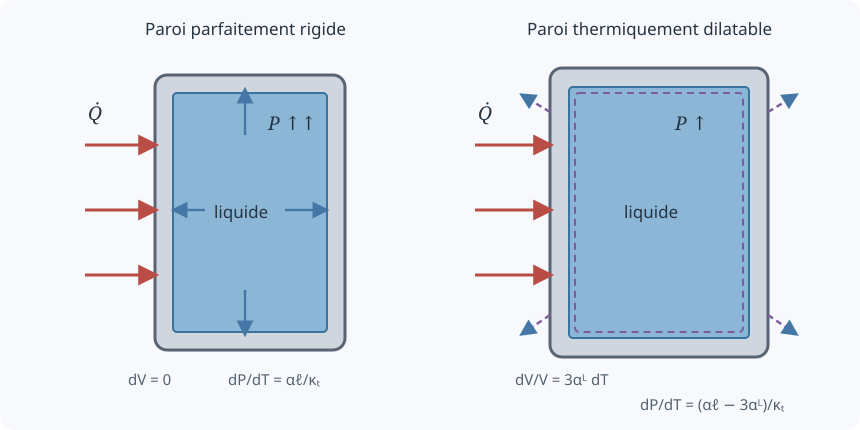

# Pressurisation thermique d'un liquide faiblement compressible

  
<strong>Domaines :</strong> thermodynamique, mécanique des fluides, transferts thermiques

  
<strong>Synonymes :</strong> liquide confiné chauffé, dilatation empêchée, pression thermique, thermal pressurization

  
<strong>Mots-clés :</strong> compressibilité isotherme, dilatation volumique, récipient fermé, bilan d'énergie, eau, paroi rigide

## Problème étudié

Un liquide, pris ici comme de l'eau, remplit entièrement un récipient cylindrique
fermé et imperméable. Son état initial est

$$
T=T_0,
\qquad
P=P_0.
$$

Un flux thermique extérieur chauffe ensuite l'ensemble. Le but est de déterminer
l'évolution de la température et surtout de la pression lorsque le liquide ne
peut pas se dilater librement.

L'idée physique essentielle est la suivante :

- à pression constante, l'eau chauffée voudrait augmenter de volume ;
- le récipient impose tout ou partie de son volume ;
- la pression augmente alors suffisamment pour recomprimer légèrement l'eau ;
- même si la compressibilité est très faible, elle ne peut pas être mise à zéro,
  car c'est précisément elle qui permet de satisfaire la contrainte géométrique.

~~~{important}
Un modèle strictement incompressible, avec $\rho$ constante quelles que soient
$P$ et $T$, ne permet pas de calculer cette pressurisation. Il faut conserver
la faible compressibilité thermodynamique du liquide.
~~~

## Configurations envisagées dans les notes

Les croquis recensent plusieurs expériences possibles :

1. récipient plein à paroi parfaitement rigide ;
2. récipient plein dont la paroi se dilate thermiquement ;
3. récipient plein à paroi élastique et thermiquement dilatable ;
4. récipient rigide contenant de l'eau et sa vapeur ;
5. récipient rigide contenant de l'eau et une poche d'air ou de gaz.

La démonstration manuscrite développe les deux premiers cas. Les trois autres
sont présentés plus loin comme prolongements, sans leur attribuer une solution
qui ne figure pas dans les calculs d'origine.

## Géométrie et hypothèses

Le récipient est un cylindre de diamètre intérieur $D$ et de hauteur $h$. Son
volume intérieur vaut

$$
V=\frac{\pi D^2h}{4}.
$$

Le facteur $1/4$ est nécessaire lorsque $D$ désigne bien le diamètre ; quelques
lignes préparatoires des notes l'omettaient avant de le réintroduire dans la
dérivation.

Le modèle est supposé zéro-dimensionnel :

$$
T(\mathbf{x},t)\simeq T(t),
\qquad
P(\mathbf{x},t)\simeq P(t).
$$

On suppose donc que le mélange interne est assez efficace pour que les
grandeurs spatiales puissent être remplacées par leurs valeurs moyennes. Le
récipient est fermé, sans fuite de masse, et l'on néglige l'énergie cinétique
macroscopique du liquide.

## 1. Bilan de masse

L'équation locale de continuité est

$$
\frac{\partial\rho}{\partial t}
+\boldsymbol{\nabla}\mathbin{\cdot}(\rho\mathbf{u})=0.
$$

Pour un volume matériel fermé, le théorème de transport de Reynolds donne

$$
\frac{\mathrm d}{\mathrm dt}
\int_{V(t)}\rho\,\mathrm dV=0.
$$

La masse $m=\int_{V(t)}\rho\,\mathrm dV$ est donc constante :

$$
\boxed{\frac{\mathrm dm}{\mathrm dt}=0}.
$$

Dans le modèle homogène, $m=\rho V$, d'où

$$
\mathrm d(\rho V)=0.
$$

Après développement,

$$
V\,\mathrm d\rho+\rho\,\mathrm dV=0,
$$

puis

$$
\boxed{
\frac{\mathrm dV}{V}
=-\frac{\mathrm d\rho}{\rho}
}.
$$

Cette relation est le lien entre la déformation du récipient et la variation
de densité du liquide.

## 2. Bilan d'énergie

L'énergie totale massique est notée

$$
E=e+\frac{\|\mathbf{u}\|^2}{2},
$$

où $e$ est l'énergie interne massique. En l'absence de forces volumiques, une
forme locale du bilan d'énergie est

$$
\frac{\partial(\rho E)}{\partial t}
+\boldsymbol{\nabla}\mathbin{\cdot}(\rho E\mathbf{u})
=-\boldsymbol{\nabla}\mathbin{\cdot}(P\mathbf{u})
+\boldsymbol{\nabla}\mathbin{\cdot}(\boldsymbol{\tau}\mathbf{u})
-\boldsymbol{\nabla}\mathbin{\cdot}\mathbf{q}.
$$

Ici, $\boldsymbol{\tau}$ est le tenseur des contraintes visqueuses et
$\mathbf{q}$ le flux thermique. La loi de Fourier s'écrit

$$
\mathbf{q}=-k\boldsymbol{\nabla}T.
$$

En intégrant sur le volume et en appliquant le théorème de Gauss,

$$
\int_V\boldsymbol{\nabla}\mathbin{\cdot}\mathbf{q}\,\mathrm dV
=\int_{\partial V}\mathbf{q}\mathbin{\cdot}\mathbf{n}\,\mathrm dS.
$$

Pour une paroi rigide sans glissement, $\mathbf{u}=0$ sur la frontière. Les
puissances de pression et de viscosité à la paroi disparaissent. Si l'on définit
la chaleur reçue positivement par

$$
\dot Q
=-\int_{\partial V}\mathbf{q}\mathbin{\cdot}\mathbf{n}\,\mathrm dS,
$$

le bilan se réduit à

$$
\frac{\mathrm d}{\mathrm dt}
\int_V\rho e\,\mathrm dV
=\dot Q.
$$

Puisque $e$ est uniforme et $m$ constant,

$$
\boxed{
m\frac{\mathrm de}{\mathrm dt}=\dot Q
}.
$$

~~~{note}
Une ligne du brouillon aboutit à $\mathrm dm/\mathrm dt=\dot Q$. C'est une
confusion de symboles : la chaleur augmente l'énergie interne, pas la masse.
Le bilan de masse donne simultanément $\mathrm dm/\mathrm dt=0$.
~~~

Si les propriétés sont prises constantes et si l'on assimile
$\mathrm de\simeq c\,\mathrm dT$, alors

$$
m c\frac{\mathrm dT}{\mathrm dt}=\dot Q.
$$

Pour une puissance thermique constante,

$$
T(t)=T_0+\frac{\dot Q}{mc}\,t.
$$

Cette loi fournit la température ; la relation thermodynamique suivante
fournira la pression correspondante.

## 3. Relation thermodynamique du liquide

La densité dépend de la pression et de la température :

$$
\rho=\rho(P,T).
$$

Sa différentielle totale est

$$
\mathrm d\rho
=\left(\frac{\partial\rho}{\partial P}\right)_T\mathrm dP
+\left(\frac{\partial\rho}{\partial T}\right)_P\mathrm dT.
$$

On introduit la compressibilité isotherme

$$
\kappa_T
=\frac1\rho
\left(\frac{\partial\rho}{\partial P}\right)_T
=-\frac1v
\left(\frac{\partial v}{\partial P}\right)_T,
$$

et le coefficient de dilatation thermique volumique du liquide

$$
\alpha_\ell
=-\frac1\rho
\left(\frac{\partial\rho}{\partial T}\right)_P
=\frac1v
\left(\frac{\partial v}{\partial T}\right)_P,
$$

avec $v=1/\rho$ le volume massique. On obtient

$$
\boxed{
\frac{\mathrm d\rho}{\rho}
=\kappa_T\,\mathrm dP-\alpha_\ell\,\mathrm dT
}.
$$

Sous la forme volumique équivalente,

$$
\boxed{
\frac{\mathrm dV}{V}
=\alpha_\ell\,\mathrm dT-\kappa_T\,\mathrm dP
}.
$$

Cette équation traduit deux effets opposés :

- chauffer à pression constante augmente le volume ;
- augmenter la pression à température constante diminue le volume.

## 4. Cas d'un récipient parfaitement rigide

Dans un récipient plein, fermé et rigide,

$$
\mathrm dV=0.
$$

Comme la masse est constante, la densité l'est aussi :

$$
\mathrm d\rho=0.
$$

La relation d'état linéarisée devient

$$
0=\kappa_T\,\mathrm dP-\alpha_\ell\,\mathrm dT.
$$

Ainsi,

$$
\boxed{
\frac{\mathrm dP}{\mathrm dT}
=\frac{\alpha_\ell}{\kappa_T}
}.
$$

Si les coefficients sont constants sur l'intervalle étudié,

$$
\boxed{
P(T)=P_0+\frac{\alpha_\ell}{\kappa_T}(T-T_0)
}.
$$

### Application numérique des notes

Les valeurs utilisées autour de $20\,^\circ\mathrm C$ sont

$$
\alpha_\ell\simeq2{,}07\times10^{-4}\ \mathrm K^{-1},
\qquad
\kappa_T\simeq4{,}6\times10^{-10}\ \mathrm{Pa}^{-1}.
$$

Le rapport vaut

$$
\begin{aligned}
\frac{\alpha_\ell}{\kappa_T}
&\simeq
\frac{2{,}07\times10^{-4}}
{4{,}6\times10^{-10}}\\
&\simeq4{,}5\times10^5\ \mathrm{Pa\,K^{-1}}\\
&\simeq4{,}5\ \mathrm{bar\,K^{-1}}.
\end{aligned}
$$

Pour un chauffage de $20$ à $30\,^\circ\mathrm C$ à partir de $1$ bar :

$$
\begin{aligned}
P_1
&=P_0+\frac{\alpha_\ell}{\kappa_T}(T_1-T_0)\\
&\simeq1+4{,}5\times10\\
&\simeq\boxed{46\ \mathrm{bar}}.
\end{aligned}
$$

Le résultat spectaculaire vient du très petit dénominateur $\kappa_T$ : une
variation infime de volume exigerait déjà une forte pression.

~~~{warning}
Cette valeur est une estimation linéarisée. Les propriétés de l'eau dépendent
de la température et de la pression, et un récipient réel n'est jamais
parfaitement rigide. La pression calculée ne doit donc pas être utilisée comme
dimensionnement de sécurité sans modèle de matériau et données certifiées.
~~~

## 5. Cas d'une paroi qui se dilate thermiquement

La seconde partie des notes autorise le récipient à se dilater avec la
température, tout en négligeant encore sa déformation élastique sous pression.

Pour un matériau isotrope, le coefficient de dilatation linéique est

$$
\alpha_L
=\frac1L
\left(\frac{\partial L}{\partial T}\right)_\sigma.
$$

Ainsi,

$$
\frac{\mathrm dD}{D}=\alpha_L\,\mathrm dT,
\qquad
\frac{\mathrm dh}{h}=\alpha_L\,\mathrm dT.
$$

Avec $V=\pi D^2h/4$, la différentielle logarithmique donne

$$
\frac{\mathrm dV}{V}
=2\frac{\mathrm dD}{D}
+\frac{\mathrm dh}{h}.
$$

Par conséquent,

$$
\boxed{
\frac{\mathrm dV}{V}
=3\alpha_L\,\mathrm dT
}.
$$

Le coefficient de dilatation volumique du récipient vaut donc

$$
\alpha_{V,\mathrm{paroi}}=3\alpha_L.
$$

Le liquide occupe toujours exactement le volume intérieur du récipient. On
égalise donc les deux variations relatives :

$$
\alpha_\ell\,\mathrm dT-\kappa_T\,\mathrm dP
=3\alpha_L\,\mathrm dT.
$$

Après réarrangement,

$$
\kappa_T\,\mathrm dP
=(\alpha_\ell-3\alpha_L)\,\mathrm dT,
$$

d'où

$$
\boxed{
\frac{\mathrm dP}{\mathrm dT}
=\frac{\alpha_\ell-3\alpha_L}{\kappa_T}
}.
$$

La dilatation de la paroi absorbe donc une partie de la dilatation que le
liquide aurait voulu produire.

### Exemple avec les valeurs manuscrites

En prenant

$$
\alpha_L\simeq12\times10^{-6}\ \mathrm K^{-1},
$$

on trouve

$$
3\alpha_L\simeq3{,}6\times10^{-5}\ \mathrm K^{-1}.
$$

Alors

$$
\begin{aligned}
\frac{\mathrm dP}{\mathrm dT}
&\simeq
\frac{2{,}07\times10^{-4}-3{,}6\times10^{-5}}
{4{,}6\times10^{-10}}\\
&\simeq3{,}72\times10^5\ \mathrm{Pa\,K^{-1}}\\
&\simeq3{,}72\ \mathrm{bar\,K^{-1}}.
\end{aligned}
$$

Pour la même hausse de $10\ \mathrm K$ à partir de $1$ bar :

$$
P_1\simeq1+3{,}72\times10
\simeq\boxed{38{,}2\ \mathrm{bar}}.
$$

La dilatation thermique du récipient réduit la pression, mais ne la supprime
pas parce que $3\alpha_L<\alpha_\ell$ avec les valeurs retenues.

## 6. Couplage entre chauffage et pression

En combinant

$$
m c\frac{\mathrm dT}{\mathrm dt}=\dot Q
$$

avec la loi du récipient rigide, on obtient

$$
\boxed{
\frac{\mathrm dP}{\mathrm dt}
=\frac{\alpha_\ell}{\kappa_T}
\frac{\dot Q}{mc}
}.
$$

Pour une paroi thermiquement dilatable,

$$
\boxed{
\frac{\mathrm dP}{\mathrm dt}
=\frac{\alpha_\ell-3\alpha_L}{\kappa_T}
\frac{\dot Q}{mc}
}.
$$

Dans ce second cas, on conserve l'approximation calorimétrique
$m c\,\mathrm dT/\mathrm dt=\dot Q$ et l'on néglige le travail mécanique de
la paroi. Un bilan thermoélastique complet devrait ajouter ce travail.

Ces expressions supposent les coefficients constants. Dans un modèle plus
fidèle, $\alpha_\ell$, $\kappa_T$, $c$ et éventuellement $\dot Q$ dépendent de
$T$ et de $P$ ; il faut alors intégrer les équations avec ces dépendances.

## 7. Les trois prolongements dessinés mais non développés

### Paroi élastique et thermiquement dilatable

Si la compliance volumique de la paroi est notée $C_V$, un modèle linéaire
serait

$$
\frac{\mathrm dV}{V}
=3\alpha_L\,\mathrm dT+C_V\,\mathrm dP.
$$

L'égalité avec la variation du liquide conduirait à

$$
\frac{\mathrm dP}{\mathrm dT}
=\frac{\alpha_\ell-3\alpha_L}{\kappa_T+C_V}.
$$

Il faut toutefois un modèle mécanique de la paroi pour déterminer $C_V$.

### Eau et vapeur

Si les deux phases coexistent à l'équilibre, la pression est principalement
liée à la pression de vapeur saturante,

$$
P\simeq P_{\mathrm{sat}}(T),
$$

tant que les deux phases sont présentes. Le chauffage peut alors transformer
du liquide en vapeur plutôt que produire immédiatement la même pressurisation.

### Eau et poche de gaz

Une poche d'air fournit un volume compressible beaucoup plus souple que l'eau.
La pression dépend alors de la loi du gaz, du volume disponible et des échanges
thermiques et massiques avec l'eau. Une loi d'état du gaz est nécessaire pour
fermer le problème.

## Résultat essentiel

Pour un liquide entièrement confiné, la pression thermique est gouvernée par
une compétition entre la dilatation du liquide et la capacité du récipient à
créer du volume.

Dans le cas rigide,

$$
\frac{\mathrm dP}{\mathrm dT}
=\frac{\alpha_\ell}{\kappa_T}.
$$

Avec une paroi isotrope qui se dilate thermiquement,

$$
\frac{\mathrm dP}{\mathrm dT}
=\frac{\alpha_\ell-3\alpha_L}{\kappa_T}.
$$

La « faible compressibilité » n'est donc pas un détail secondaire du modèle :
elle est le mécanisme qui convertit la dilatation empêchée en pression.
