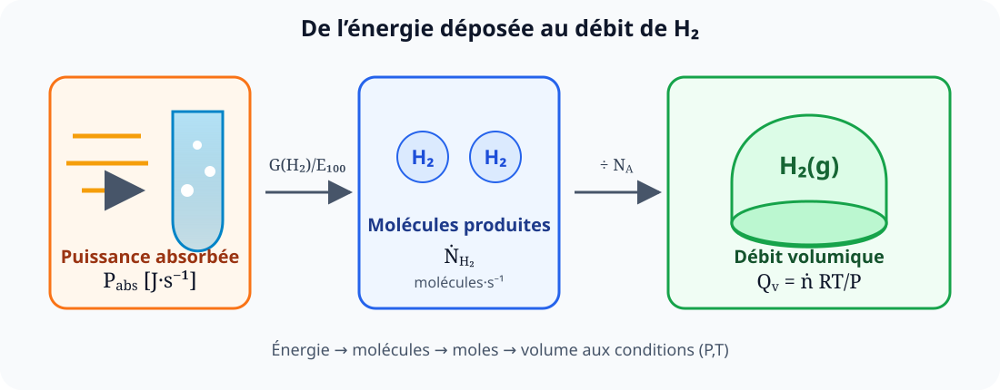

# Production d’hydrogène par radiolyse de l’eau

  
<strong>Domaines :</strong> physico-chimie, rayonnements, thermodynamique

  
<strong>Synonymes :</strong> radiolyse de l’eau, dégagement radiolytique d’hydrogène, débit d’hydrogène radiolytique

  
<strong>Mots-clés :</strong> hydrogène, rendement radiolytique, puissance absorbée, nombre d’Avogadro, gaz parfait, TPN

La radiolyse de l’eau est sa transformation sous l’action d’un rayonnement
ionisant. L’énergie déposée excite et ionise les molécules d’eau, puis une
succession de réactions très rapides produit notamment des espèces radicalaires
et moléculaires.

Les notes cherchent surtout à répondre à une question d’ingénierie : **quel
débit volumique d’hydrogène correspond à une puissance radiative absorbée
donnée ?**

## De l’eau irradiée aux produits de radiolyse

La première étape peut être représentée schématiquement par

$$
\mathrm{H_2O}
\xrightarrow{\text{rayonnement ionisant}}
\mathrm{H_2O^+},\ \mathrm{e^-},\ \mathrm{H_2O^*}.
$$

Ces espèces primaires évoluent ensuite vers des radicaux très réactifs,
notamment

$$
\mathrm{H^\bullet}
\qquad\text{et}\qquad
\mathrm{OH^\bullet},
$$

ainsi que vers des produits moléculaires tels que

$$
\mathrm{H_2},
\qquad
\mathrm{H_2O_2}
\qquad\text{et, selon les conditions,}\qquad
\mathrm{O_2}.
$$

Une écriture globale idéalisée du bilan de décomposition est

$$
2\,\mathrm{H_2O}
\longrightarrow
2\,\mathrm{H_2}+\mathrm{O_2}.
$$

Cette équation donne un bilan atomique, mais elle ne décrit pas à elle seule
les rendements réels : une partie des espèces formées se recombine dans le
liquide. C’est précisément pour cela que l’on introduit un rendement
radiolytique expérimental.

## Rendement radiolytique de l’hydrogène

On note

$$
G(\mathrm{H_2})
$$

le nombre de molécules de dihydrogène produites pour une énergie absorbée de
$100\ \mathrm{eV}$. Son unité usuelle est donc

$$
\frac{\text{molécules de }\mathrm{H_2}}{100\ \mathrm{eV}}.
$$

L’énergie correspondant à $100\ \mathrm{eV}$ vaut

$$
\begin{aligned}
E_{100}
&=100\times 1{,}602\,176\,634\times10^{-19}\ \mathrm{J}\\
&=\boxed{1{,}602\,176\,634\times10^{-17}\ \mathrm{J}}.
\end{aligned}
$$

Soit $P_{\mathrm{abs}}$ la puissance effectivement absorbée par l’eau :

$$
[P_{\mathrm{abs}}]=\mathrm{J\,s^{-1}}=\mathrm{W}.
$$

Le nombre de paquets de $100\ \mathrm{eV}$ déposés chaque seconde est

$$
\frac{P_{\mathrm{abs}}}{E_{100}}.
$$

Le débit de production en molécules d’hydrogène est donc

$$
\boxed{
\dot N_{\mathrm{H_2}}
=\frac{P_{\mathrm{abs}}}{E_{100}}G(\mathrm{H_2})
}
\qquad
[\dot N_{\mathrm{H_2}}]=\mathrm{molécules\,s^{-1}}.
$$

## Passage des molécules aux moles

Le nombre d’Avogadro relie le nombre de molécules au nombre de moles :

$$
n=\frac{N}{N_A},
$$

avec

$$
N_A=6{,}022\,140\,76\times10^{23}\ \mathrm{mol^{-1}}.
$$

Le débit molaire d’hydrogène vaut alors

$$
\boxed{
\dot n_{\mathrm{H_2}}
=\frac{P_{\mathrm{abs}}G(\mathrm{H_2})}
{E_{100}N_A}
}
\qquad
[\dot n_{\mathrm{H_2}}]=\mathrm{mol\,s^{-1}}.
$$

## Débit volumique aux TPN

Aux conditions normales de température et de pression retenues dans les
notes, le volume molaire est approximativement

$$
\overline V_{m,\mathrm{TPN}}
\simeq 22{,}4\ \mathrm{L\,mol^{-1}}
=22{,}4\times10^{-3}\ \mathrm{m^3\,mol^{-1}}.
$$

Le débit volumique s’obtient en multipliant le débit molaire par ce volume :

$$
Q_{v,\mathrm{TPN}}
=\dot n_{\mathrm{H_2}}\,
\overline V_{m,\mathrm{TPN}}.
$$

Par conséquent,

$$
\boxed{
Q_{v,\mathrm{TPN}}
=
\frac{P_{\mathrm{abs}}G(\mathrm{H_2})}
{E_{100}N_A}
\overline V_{m,\mathrm{TPN}}
}
\qquad
[Q_v]=\mathrm{m^3\,s^{-1}}.
$$

L’analyse dimensionnelle confirme le résultat :

$$
\frac{\mathrm{J}}{\mathrm{s}}
\frac{1}{\mathrm{J}}
\frac{\text{molécules}}{1}
\frac{\mathrm{mol}}{\text{molécules}}
\frac{\mathrm{m^3}}{\mathrm{mol}}
=\frac{\mathrm{m^3}}{\mathrm{s}}.
$$

## Débit volumique à une pression et une température quelconques

Pour un gaz parfait,

$$
PV=nRT,
$$

donc le volume molaire à la pression $P$ et à la température absolue $T$ est

$$
\overline V_m(P,T)=\frac{RT}{P}.
$$

En remplaçant le volume molaire TPN par cette expression,

$$
\begin{aligned}
Q_v(P,T)
&=\dot n_{\mathrm{H_2}}\frac{RT}{P}\\[1mm]
&=\frac{P_{\mathrm{abs}}G(\mathrm{H_2})}
{E_{100}N_A}\frac{RT}{P}.
\end{aligned}
$$

Ainsi,

$$
\boxed{
Q_v(P,T)
=
\frac{P_{\mathrm{abs}}G(\mathrm{H_2})R}{E_{100}N_A}
\frac{T}{P}
}.
$$

À production molaire fixée, le débit volumique est donc proportionnel à la
température et inversement proportionnel à la pression.

## Retrouver l’écriture compacte des notes

Les pages manuscrites semblent regrouper le rendement et l’énergie de
référence dans une énergie effective par molécule produite. Posons

$$
E_{\mathrm{H_2}}^{\mathrm{eff}}
=\frac{E_{100}}{G(\mathrm{H_2})}.
$$

Cette grandeur représente l’énergie absorbée nécessaire, en moyenne, pour
produire une molécule de $\mathrm{H_2}$. On retrouve alors les formes compactes

$$
\dot N_{\mathrm{H_2}}
=\frac{P_{\mathrm{abs}}}{E_{\mathrm{H_2}}^{\mathrm{eff}}},
$$

$$
\boxed{
Q_{v,\mathrm{TPN}}
=\frac{P_{\mathrm{abs}}}{E_{\mathrm{H_2}}^{\mathrm{eff}}}
\frac{\overline V_{m,\mathrm{TPN}}}{N_A}
},
$$

et

$$
\boxed{
Q_v(P,T)
=\frac{P_{\mathrm{abs}}}{E_{\mathrm{H_2}}^{\mathrm{eff}}}
\frac{R}{N_A}\frac{T}{P}
}.
$$

## Si la puissance incidente n’est pas entièrement absorbée

La puissance à employer dans les formules est la puissance **déposée dans
l’eau**, non nécessairement la puissance émise par la source. Si seule une
fraction $f_{\mathrm{abs}}$ de la puissance incidente $P_{\mathrm{inc}}$ est
absorbée,

$$
P_{\mathrm{abs}}=f_{\mathrm{abs}}P_{\mathrm{inc}},
\qquad 0\le f_{\mathrm{abs}}\le1.
$$

Le débit devient

$$
Q_v(P,T)
=
\frac{f_{\mathrm{abs}}P_{\mathrm{inc}}G(\mathrm{H_2})R}
{E_{100}N_A}
\frac{T}{P}.
$$

## Points de vigilance

- La température doit être exprimée en kelvins et la pression en pascals si
  l’on emploie $R$ en unités SI.
- Il faut annoncer les conditions de référence d’un débit en
  $\mathrm{Nm^3\,s^{-1}}$ ou en $\mathrm{NL\,h^{-1}}$ : la valeur du volume
  molaire dépend de la convention choisie.
- Le rendement $G(\mathrm{H_2})$ dépend du rayonnement, du milieu, de la
  température et des espèces dissoutes ; il ne faut pas le remplacer par la
  stœchiométrie globale de décomposition.
- Le dihydrogène est inflammable. Le dioxygène et les espèces oxydantes issus
  de la radiolyse peuvent en outre modifier fortement la chimie et la
  corrosion du système.

