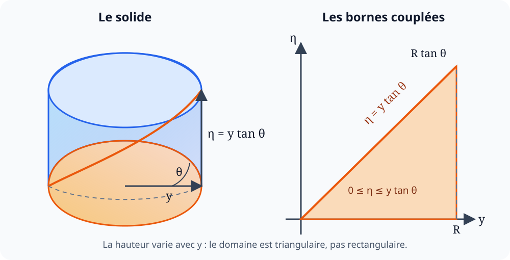

# Volume d’un onglet cylindrique

  
<strong>Domaines :</strong> mathématiques, géométrie, calcul intégral

  
<strong>Synonymes :</strong> coin cylindrique, cale cylindrique, cylindre coupé par un plan oblique

  
<strong>Mots-clés :</strong> intégrale triple, domaine d’intégration, demi-disque, moment statique, changement d’ordre

On cherche le volume du morceau découpé dans un cylindre de rayon $R$ par
un plan oblique. La forme évoque une portion de fromage, d’où le nom
provisoire « camembert » dans les notes ; en géométrie, ce solide est plutôt
appelé un **onglet cylindrique**.

Le plan de coupe passe par un diamètre de la base et forme un angle $\theta$
avec celle-ci. Sa hauteur n’est donc pas constante : elle augmente
linéairement lorsqu’on s’éloigne du diamètre.

## Mise en équations

On place le demi-disque de base dans le plan $(x,y)$ :

$$
D=\left\{(x,y)\,\middle|\,
0\le y\le R,
-\sqrt{R^2-y^2}\le x\le\sqrt{R^2-y^2}
\right\}.
$$

La coordonnée verticale est notée $\eta$, afin de ne pas la confondre avec
la coordonnée $y$ du demi-disque. Dans une section perpendiculaire au diamètre,
la trigonométrie donne

$$
\tan\theta=\frac{\eta}{y},
$$

donc la hauteur du plan de coupe au point d’ordonnée $y$ est

$$
\boxed{\eta_{\max}(y)=y\tan\theta}.
$$

Au bord du cylindre, $y=R$, cette hauteur atteint

$$
\eta_{\max}(R)=R\tan\theta.
$$

Cette dernière valeur est seulement la **hauteur maximale** de l’onglet ; ce
n’est pas sa hauteur en tout point.

## L’intégrale triple dans l’ordre des notes

Les premières lignes des notes choisissent d’abord $\eta$. Pour une hauteur
fixée, la relation $\eta\le y\tan\theta$ impose

$$
y\ge\frac{\eta}{\tan\theta}.
$$

Les bornes sont alors

$$
\begin{cases}
0\le \eta\le R\tan\theta,\\[1mm]
\dfrac{\eta}{\tan\theta}\le y\le R,\\[3mm]
-\sqrt{R^2-y^2}\le x\le\sqrt{R^2-y^2}.
\end{cases}
$$

Le volume s’écrit donc bien

$$
\boxed{
V=
\int_0^{R\tan\theta}
\int_{\eta/\tan\theta}^{R}
\int_{-\sqrt{R^2-y^2}}^{\sqrt{R^2-y^2}}
dx\,dy\,d\eta
}.
$$

Après l’intégration selon $x$,

$$
V=
2\int_0^{R\tan\theta}
\int_{\eta/\tan\theta}^{R}
\sqrt{R^2-y^2}\,dy\,d\eta.
$$

Cette expression est correcte, mais son calcul direct n’est pas le plus
simple. La borne inférieure $y=\eta/\tan\theta$ contient encore $\eta$.

## Le passage qui change accidentellement le solide

La suite manuscrite remplace implicitement les bornes précédentes par

$$
0\le y\le R,
\qquad
0\le\eta\le R\tan\theta.
$$

On obtient alors

$$
2\int_0^R\int_0^{R\tan\theta}
\sqrt{R^2-y^2}\,d\eta\,dy
=2R\tan\theta\int_0^R\sqrt{R^2-y^2}\,dy.
$$

Or les nouvelles bornes décrivent un rectangle dans le plan $(y,\eta)$,
alors que l’onglet occupe le triangle $0\le\eta\le y\tan\theta$.
Géométriquement, cette intégrale calcule donc un **demi-cylindre de hauteur
constante** $R\tan\theta$, pas l’onglet.

Les notes évaluent correctement l’intégrale restante. Avec

$$
y=R\sin u,
\qquad
dy=R\cos u\,du,
$$

on a

$$
\sqrt{R^2-y^2}=R\cos u
$$

et les bornes deviennent $u=0$ et $u=\pi/2$. Ainsi,

$$
\begin{aligned}
I
&=\int_0^R\sqrt{R^2-y^2}\,dy\\
&=R^2\int_0^{\pi/2}\cos^2u\,du\\
&=\frac{R^2}{2}\int_0^{\pi/2}(1+\cos 2u)\,du\\
&=\frac{R^2}{2}
\left[u+\frac12\sin 2u\right]_0^{\pi/2}\\
&=\boxed{\frac{\pi R^2}{4}}.
\end{aligned}
$$

C’est bien l’aire d’un quart de disque. Elle conduirait ici au volume du
solide rectangulaire agrandi,

$$
V_{\mathrm{demi\text{-}cylindre}}
=\frac{\pi}{2}R^3\tan\theta,
$$

mais pas au volume recherché.

## Correction par changement de l’ordre d’intégration

Il suffit de choisir d’abord un point $(x,y)$ du demi-disque, puis de faire
varier $\eta$ entre la base et le plan oblique :

$$
V=
\int_0^R
\int_{-\sqrt{R^2-y^2}}^{\sqrt{R^2-y^2}}
\int_0^{y\tan\theta}
d\eta\,dx\,dy.
$$

L’intégration selon $\eta$ donne la hauteur locale :

$$
V=
\int_0^R
\int_{-\sqrt{R^2-y^2}}^{\sqrt{R^2-y^2}}
y\tan\theta\,dx\,dy.
$$

Puis la largeur du demi-disque à l’ordonnée $y$ vaut
$2\sqrt{R^2-y^2}$, d’où

$$
V=2\tan\theta
\int_0^R y\sqrt{R^2-y^2}\,dy.
$$

Posons

$$
u=R^2-y^2,
\qquad
du=-2y\,dy.
$$

Alors

$$
\begin{aligned}
\int_0^R y\sqrt{R^2-y^2}\,dy
&=-\frac12\int_{R^2}^{0}\sqrt{u}\,du\\
&=\frac12\int_0^{R^2}u^{1/2}\,du\\
&=\frac12\left[\frac23u^{3/2}\right]_0^{R^2}\\
&=\frac{R^3}{3}.
\end{aligned}
$$

Finalement,

$$
\boxed{V=\frac{2}{3}R^3\tan\theta}.
$$

## Lecture géométrique par le centre de gravité

Cette même formule se comprend sans intégrale triple. La hauteur locale est
$y\tan\theta$, donc

$$
V=\tan\theta\iint_D y\,dA.
$$

Le demi-disque possède l’aire

$$
A_D=\frac{\pi R^2}{2}
$$

et son centre de gravité se trouve à la distance

$$
\bar y=\frac{4R}{3\pi}
$$

du diamètre. Son moment statique vaut alors

$$
\iint_D y\,dA=A_D\bar y
=\frac{\pi R^2}{2}\frac{4R}{3\pi}
=\frac{2R^3}{3}.
$$

On retrouve immédiatement

$$
V=\frac{2}{3}R^3\tan\theta.
$$

## Contrôles rapides

- Si $\theta=0$, le plan est confondu avec la base et $V=0$.
- Le résultat est proportionnel à $R^3$, comme tout volume obtenu en
  agrandissant une figure semblable.
- L’onglet est inclus dans le demi-cylindre de hauteur $R\tan\theta$ ; on a
  bien

  $$
  \frac{2}{3}R^3\tan\theta
  <\frac{\pi}{2}R^3\tan\theta.
  $$

~~~{note}
La formule suppose que $\theta$ désigne, comme dans les notes, l’angle entre
le plan oblique et la base circulaire. Si l’angle est mesuré par rapport à
l’axe du cylindre, il est complémentaire et le facteur $\tan\theta$ doit être
réécrit en conséquence.
~~~

